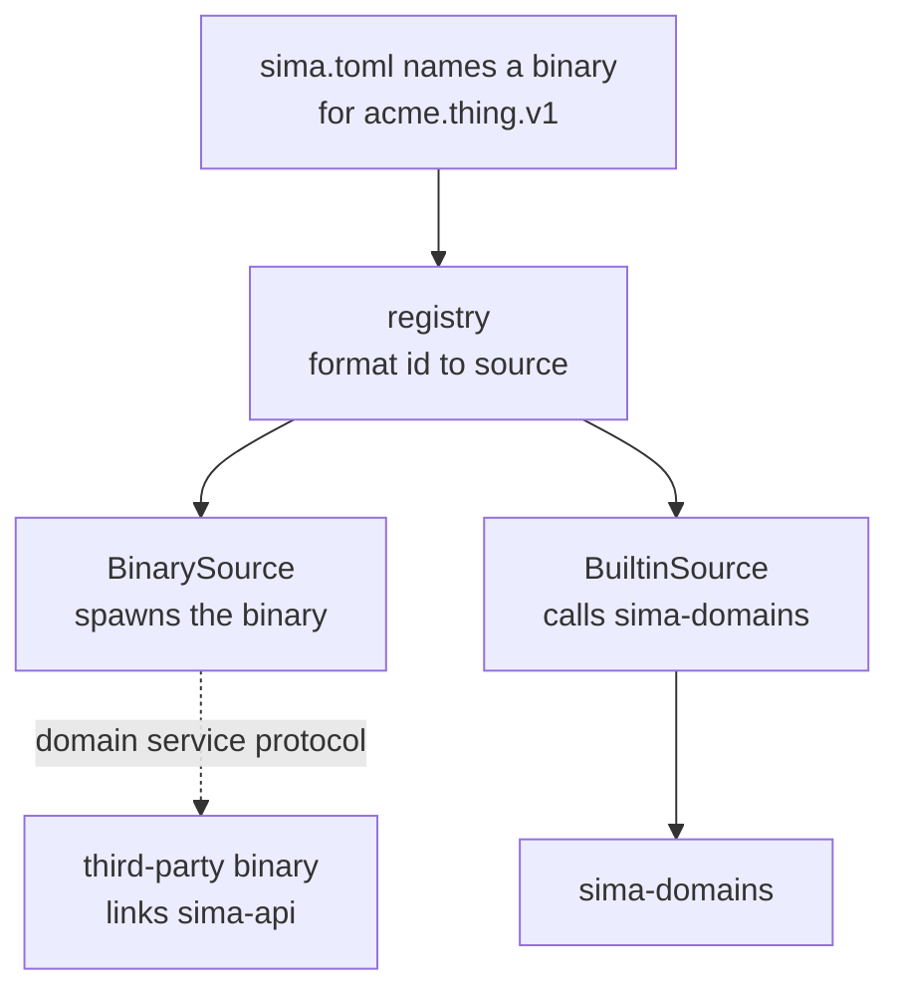
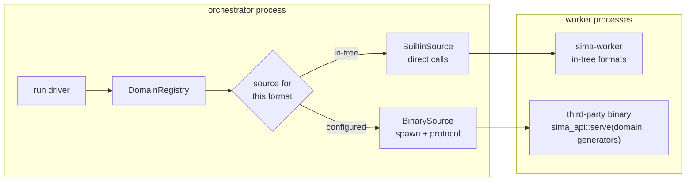
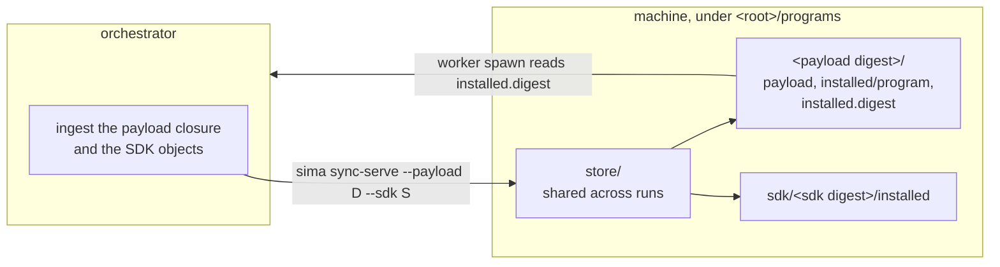

# Architecture

sima is a substrate for deterministic, reproducible execution of GPU
programs and search over them. A program is opaque compute: the substrate
runs it, records the result under a content address, and never interprets
what it computes. The current specialization is neural networks and
cellular-automata-like programs. `README.md` records
the motivation and design; `TODO.md` the roadmap; `AGENTS.md` the project
rules. This document describes the implemented system, and the rules that
govern it are stated first.

sima runs in three execution modes:

- **local** — one machine runs the search end to end.
- **slingshot** — a local process dispatches execution to a more powerful
  remote machine and collects the results.
- **distributed** — many machines run many experiments together.

Local is implemented first. The store and identity model are designed so
slingshot and distributed add transport over the same objects, not new
semantics: a result computed on any machine carries the same content address
and commits to the same catalog.

## RULES

`README.md` is the design document; the near-term work list is `TODO.md`.
Rust; local execution first, distributed by design.

Invariants below are settled in discussion before being recorded here; new
ones are added the same way.

### Settled invariants

- Execution backends are implementation crates under `crates/toolkits/` (`sima-toolkit-*`), depending on `sima-core` (and `sima-contracts` when needed); `sima-domains` depends on the toolkits its domains use, and each toolkit isolates its own dependency set.
- The store is the only durable state. Queues, schedulers, and orchestrators are ephemeral; a task source derives the currently-runnable frontier from (config, store state) — static batches and segment chains are two implementations of that one interface. Resume, crash-recovery, and re-run are one code path: re-derive the frontier, continue.
- One orchestrator per run — the `sima run` process itself, no daemon; single-writer enforced by an OS file lock the kernel releases when the holder exits, so no staleness protocol exists; the lock file's content (pid, hostname) is diagnostic only. Workers are stateless leaseholders.
- Executors are pure compute: they receive (spec, params, seed, env) and return artifacts + stats, never touching the store. Workers commit results through the catalog. The trust boundary lives here. A config-routed program is spawned across that boundary with an explicit environment — a baseline allowlist plus the variable names its entry declares — in a fresh scratch working directory removed at reap, and every protocol answer it owes is bounded by `answer_timeout_ms` except generation, which is compute. Such a program's identity is what it declares through its environment components and nothing else; the digest of the file that served each session is journal provenance, and a resume whose program digest changed stops until the invocation accepts it.
- Candidates are opaque at the infrastructure layer: a spec is (format id, opaque bytes), content-addressed. Domains interpret specs; "genome" is domain vocabulary. Run parameters are a second opaque content-addressed blob (params): generators produce specs, config produces params, and the spec's format id governs the interpretation of both — so one candidate stays addressable across evaluation stages and the generator contract never carries evaluation policy.
- Two serialization worlds: identity-bearing bytes (anything hashed) go through the canonical `Enc`/`Dec` encoding exclusively; human-readable artifacts are serde and never identity-bearing.
- Reproducibility is declared per domain across two tiers (README, Determinism), not assumed uniform. The infrastructure guarantees run identity regardless: manifests are canonicalized so run hashes are independent of worker completion order, and journals are observational, excluded from equality criteria.
- Structured events are the `sima-trace` facade at L0.5, directly above `sima-core`: the typed event vocabulary, journal records, emitters, and one collector thread any layer emits into without an upward edge. The collector is the single-writer boundary — it stamps each event, appends the journal line through a `DurableSink` the store implements (which keeps the facade below the store), then hands the record to the run's observer; the journal write precedes the observer, and a child's events cross the wire as opaque frames the parent forwards to the collector.
- A poisoned in-process `Mutex` is recovered, never propagated: every `lock` here reads `unwrap_or_else(PoisonError::into_inner)`. Poisoning means some thread panicked holding the lock, and the panic itself is already reported through the path that caught it — the run thread's `catch_unwind`, the worker's, the collector's join. Escalating a second panic out of an unrelated reader adds no information and takes down a run that is otherwise winding down cleanly. Where a panic could leave state half-written, the guarded value is shaped so a torn state is not reachable: a slot holds a whole value or none.

### Principles

- Clean, pristine architecture: clear spine, truthful boundaries, no split brain.
- No unjustified repeated code; justify file count / splits; deliberate naming.
- No bootstrapping garbage in the active path; isolate platform-specific code cleanly.
- Maintain a clear, data-driven flow of information.
- Every milestone serves the real search substrate, optimizing for correctness and architecture, not demos.

## Layering

Strictly downward dependencies, enforced by workspace crate edges.

| Layer | Crate            | Responsibility                                                        |
|-------|------------------|-----------------------------------------------------------------------|
| L0    | `sima-core`      | error type, canonical encoding, content hash, PRNG                    |
| L0.5  | `sima-trace`     | structured events: the typed vocabulary, journal records, emitters, the collector |
| L1    | `sima-model`     | identity vocabulary: spec, params, environment, task key, record, run config |
| L2    | `sima-store`     | durable state: CAS, task index, run manifests, journals               |
| L3    | `sima-contracts` | generator/executor contracts over opaque specs and params            |
| L4    | `sima-transport` | worker transport: wire protocol, executor host loop, subprocess and loopback links |
| L5    | `sima-domains`   | per-format executors, generators, codecs, environments, id dispatch, and config translation; the reference stub domain |
| L6    | `sima-scheduler` | task sources, worker pool, leases, retry, device placement, run driver |
| L7    | `sima-pipeline`  | config loading, orchestration, run and per-task queries               |
| L8    | `sima`           | CLI: run, status, report, rm, reconcile, tui, follow                  |

Beside the spine, `sima-worker` is the worker binary: it depends on
`sima-transport` (the executor host loop) and `sima-domains` (the executor
its format id resolves to), and nothing depends on it. The orchestrator
spawns one `sima-worker` process per worker slot.

The store is the only durable state. Queues, schedulers, and orchestrators
are ephemeral: the runnable frontier is derived from (config, store state),
so resume, crash-recovery, and re-run are one code path.

`sima-provider` also sits beside the spine, above the store: it is the
rented-hardware control plane, depending on `sima-core`, `sima-model`, and
`sima-store`, and it carries the contract, the offer model, and the
in-memory stub. Backends speaking to a real service are a sibling group
under `crates/providers/`, named `sima-provider-<name>` after the service
each one speaks to, so an HTTP client enters exactly one crate. The CLI
depends on the control plane and on each backend, because resolving a ledger
record's provider id to the backend that answers to it is what
`sima reconcile` does. See [`sima-provider`](#sima-provider).

`sima-api` sits beside the spine with no layer of its own: it depends on
`sima-core`, `sima-model`, and `sima-contracts`, and nothing in the workspace
depends on it. It is the surface an executor written outside this workspace is
written against — re-exports and documentation, no logic — so the three crates
behind it stay free to reorganise as long as it keeps naming the same items.
`sima-example-executor` is the smallest implementation that compiles against
it, and its manifest, naming `sima-api` as its only sima dependency, is what
holds the surface to that promise. See
[Extension surface](#extension-surface).

Execution backends sit off the spine as a sibling group under
`crates/toolkits/` (`sima-toolkit-*`). A toolkit is a compute library a domain
computes on, below `sima-domains` and beside `sima-contracts`: it depends on
`sima-core` (and `sima-contracts` when it needs the contract types) and each
isolates its own dependency set. `sima-domains` depends on the toolkits its
executors use. See [Execution toolkits](#execution-toolkits).

## Anatomy of a run

The component hierarchy of one running `sima run` process, with the store it
drives. Later sections describe each component in detail.

```
sima run  (one orchestrator process per run; OS file lock on the store)
│
├─ Store ················ the only durable state
│    objects/                 content-addressed bytes (specs, params,
│                             states, artifacts)
│    tasks/<key>              committed task records
│    runs/<run-id>/
│      manifest.json          written once, at finalize
│      journal                append-only lifecycle events
│      checkpoint/<chain>     mutable resume scratch, one slot per chain
│      placement/<chain>      the device class each chain's work runs on
│
└─ Driver ··············· polls the source on queue drain, feeds the
   │                      queue, finalizes on empty poll + idle pool
   │
   ├─ TaskSource ········ derives the runnable frontier from (config, store)
   │   ├─ StaticBatch        segments absent: one stateless task per candidate
   │   └─ SegmentChain       segments = N: one chain per candidate
   │       └─ Chain ····· the source's in-memory cursor over one
   │           │          candidate's chain — no thread, no lease, no
   │           │          durable form of its own:
   │           │            spec, spec_id   the candidate under evaluation
   │           │            seed            constant across the chain
   │           │            frontier        next uncommitted segment's
   │           │                            identity; None when walked out
   │           │            committed       segments walked past so far
   │           │            handed_out      frontier is out with a worker
   │           │
   │           └─ Segment (yielded one at a time, as RunnableTask)
   │                key = hash(spec, params, seed, env, input_state)
   │                segment 0:   input_state = None
   │                segment j+1: input_state = hash of segment j's
   │                             committed "state" artifact
   │
   ├─ Coordinator ······· in-memory queue + leases + release counter
   ├─ Collector ········· one thread: events → stamp → journal → observer
   │
   └─ Worker pool (N threads, stateless leaseholders)
       └─ Worker ········ leases one task = drives one attempt on its child
           │
           ├─ WorkerLink · the conversation with one sima-worker process:
           │               assign over its stdin, events off its stdout,
           │               the attempt deadline as the wait bound, SIGKILL
           │               as preemption
           │
           │      sima-worker (child process, pure compute)
           │        └─ Executor ·· execute(input, ctx, checkpoint); offers
           │                       continuation bytes at its own cadence,
           │                       never touches the store — it has no path
           │
           ├─ checkpoint slot ··· parent-side: loads resume bytes before
           │                      assignment, persists each received save
           │                      to checkpoint/<chain>
           │
           └─ commit ···· artifacts → objects, then the task record
```

A chain exists durably only as the trail of committed records linked by
`input_state` hashes in the store; `Chain` is the cursor `SegmentChain`
rebuilds from that trail at construction, which is why crash recovery,
interrupt resume, and re-run are one code path.

The diagram holds two continuation mechanisms that carry the same bytes
under different guarantees. Checkpoint = crash recovery within a run: a
disposable scratch slot, outside every hash, that only shortens a restarted
attempt. Segment state = a result another run can legitimately start from: a
committed, addressable artifact, which is what lets a longer run reuse the
shared prefix of a shorter one.

## Two serialization worlds

- **Identity-bearing bytes** — anything hashed — use the canonical binary
  `Enc`/`Dec` encoding exclusively. The encoding is deterministic and
  self-delimiting: a value has exactly one byte image, and that image parses
  without external length hints. A value's id is the blake3 hash of its
  standalone canonical bytes, so the id doubles as its address in the CAS.
- **Human-readable data** uses serde: JSON for the run manifest, plain-text
  lines for the journal. It carries observational or index data and is never
  identity-bearing.

## `sima-core` (L0)

The foundation every crate shares:

- A single error type — one closed enum spanning encoding, validation, I/O,
  corruption, and missing-object failures — so `Result` means the same thing
  in every crate.
- A canonical binary encoding: deterministic and self-delimiting, the sole
  route for identity-bearing bytes.
- Content addressing over blake3: a value's id is the hash of its canonical
  bytes, and that hash is its address in the store.
- A CPU/GPU-stable PRNG: counter-based, specified for identical results on
  CPU and GPU, pinned by known-answer tests. The `rand` crate is barred from
  result-affecting paths.

## `sima-trace` (L0.5)

The structured-event facade: one typed vocabulary any layer can emit,
funneled through one collector into the run's journal and out to the
run's live observer. The crate sits directly above `sima-core`, so scheduler,
transport, and worker host all emit without an upward edge. Events are
observational — they record what happened, never run identity — so their
serialization world is serde, and the stream is excluded from every
equality criterion.

- **`Event`** — the vocabulary: the run-lifecycle variants (see
  [Journal events](#journal-events)) plus `Diagnostic`, a correlated line
  of observational text: a level (`info`/`warn`/`error`), a source (for
  example `worker stderr`, `panic`, `transport`), the message, and optional
  `worker`/`host`/`task` context keys — optional because a diagnostic may
  precede any lease or follow the run's end.
- **`Record`** — the journal line type: a `ts_ms` wall-clock stamp plus
  the event, flattened, so the line is flat — the event's own keys sit
  beside `ts_ms` at the top level. The stamp is required: a line lacking
  it is a parse error.
- **`Emitter`** — a cloneable channel handle; `emit` is fire-and-forget,
  and a closed channel drops the event silently. Components that emit
  receive an emitter explicitly at construction — there is no process
  global and no thread-local propagation. Causality context is the natural
  keys: events carry `run`, `task`, `attempt`, `worker`, and `host`
  directly as fields.
- **`Collector`** — one scoped thread drains the channel; it takes one
  blocking event and everything already queued behind it, stamps each
  `ts_ms` (a single clock, read at append time — remote events are
  stamped on arrival), appends the batch's lines through a
  **`DurableSink`**, then hands the records to the run's observer in
  order. The ordering guarantee: the journal write for an event happens
  before the observer sees it, and the observer sees records in journal
  order, from one calling thread. The batch is what keeps a durability
  barrier from being paid per event — a run committing tasks faster than
  that would otherwise be capped at the sink's own rate however many
  workers it has. A crash mid-batch loses the events the sink had not
  made durable, which the observational journal already permits: it is
  not a write-ahead log, and a resume derives its frontier from the
  store's records. The first append or encoding failure stops the
  collector and surfaces when it is joined.

`DurableSink` is the boundary that keeps the crate below the store:
`sima-store` implements it for its journal writer, so the collector appends
through the same crash-safe path as any other journal line.

## `sima-model` (L1)

Pure data, no I/O; depends on `sima-core` only. Every encoding opens with a
length-prefixed string domain tag, fixed forever (a layout change mints a
`.v2`):

| Tag                   | Type           | Id            |
|-----------------------|----------------|---------------|
| `sima.spec.v1`        | `Spec`         | `SpecId`      |
| `sima.params.v1`      | `Params`       | `ParamsId`    |
| `sima.environment.v1` | `Environment`  | `EnvironmentId` |
| `sima.task.v1`        | `TaskIdentity` | `TaskKey`     |
| `sima.task-record.v1` | `TaskRecord`   | —             |
| `sima.run-config.v1`  | `RunConfig`    | `RunId`       |

- A spec is (format id, opaque bytes): the candidate. Params is a second
  opaque blob: the evaluation settings. The spec's format id governs the
  interpretation of both; generators produce specs, config produces params.
- The task key preimage is spec ‖ params ‖ seed ‖ environment ‖
  input-state-ref (`None` for stateless tasks; segments differing only in
  input state get distinct keys).
- `Environment` components are content-derived only (versioned constants,
  content digests). Machine-derived facts (hostname, device, time) are
  journal material, or run portability fails by construction.
- Identity and execution split: `RunConfig` holds the identity-bearing
  config only — `RunId = blake3(config bytes)` survives changes in worker
  count, store path, or hardware. The optional segment count is part of it:
  work division is structural, so runs of different segmentation are
  different runs. `TaskRecord` holds identity plus artifact
  references only — attempts, timings, and workers live in the journal.
- Names (format ids, generator ids, component and artifact names): 1..=64
  bytes of `[a-z0-9._-]`.

## `sima-store` (L2)

One `Store` type over a root directory:

```
<root>/format                    store-format marker: the one line "1"
<root>/objects/<aa>/<hash>       CAS object bytes; aa = first two hex chars
<root>/packs/<hash>.pack         many objects and an index, in one file
<root>/packs/maintenance.lock    serializes packing, sweeping, pack rewrites
<root>/tmp/<pid>-<seq>           in-flight writes
<root>/tasks/<task-key>          index entry: record-hash hex + newline
<root>/instances/<tag>           one rented instance's ledger record
<root>/spend/<owner>/<tag>-<started-ms>  one closed rental's cost
<root>/machines/<provider>-<machine>/<tag>-<occurred-ms>  one incident
<root>/runs/<run-id>/manifest.json
<root>/runs/<run-id>/journal
<root>/runs/<run-id>/orchestrator.lock
<root>/runs/<run-id>/checkpoint/<slot>   mutable resume scratch
<root>/runs/<run-id>/placement/<chain>  the chain's device class
<root>/runs/<run-id>/remove-intent      a removal's resumable plan
```

### Components

- **object** — a content-addressed blob: bytes stored under the blake3 hash
  of those bytes. Every model id is the address of its object.
- **pack** — one immutable file holding many objects, an index over them, and
  a footer locating that index; its name is the blake3 hash of the whole
  file. Each object inside is compressed on its own, so reading one object
  decompresses one object, and each is addressed by the hash of its
  *uncompressed* bytes — the address a loose object has. The header names
  the pack format's own version, currently 1, validated when the index
  loads and versioned independently of the store-format marker.
- **store-format marker** — the `format` file naming the version of the
  layout beneath it. `Store::open` writes it when absent and refuses any
  other version, naming both, so a layout change fails with a sentence
  rather than with missing objects mid-operation.
- **task index** — the `tasks/` tree recording, for each answered task, the
  result that answers it. A task source reads it to derive what remains
  runnable.
- **index entry** — the file at `tasks/<task-key>` holding the hex address
  of the record object answering that task, newline-terminated: the task
  index's per-task cell.
- **record** — a `TaskRecord` object: the identity of one evaluation plus
  the addresses of its artifacts. One record answers one task.
- **run** — one search invocation, identified by `RunId`, the hash of its
  config's canonical bytes, which is also the address of the config object.
- **manifest** — a finalized run's `(task, record)` list sorted by task key:
  the fixed set of tasks the run comprises.
- **journal** — a run's append-only observational history, one event per
  line.
- **checkpoint slot** — a run's mutable per-chain scratch file holding the
  latest continuation state a running segment offered. Written atomically,
  latest-only, never hashed and never part of a manifest or closure; a slot
  that is missing, torn, or keyed to another task loads as nothing.
- **closure** — the deduplicated, sorted set of objects a finalized run
  depends on: config, records, and every object those records reference. The
  unit of run portability and store sync.
- **spend entry** — what one rental cost, from its ledger record's stamp to
  its confirmed destruction. It is written when the rental is closed out and
  outlives the record, so a run's total spend survives every machine it
  rented.
- **removal** — deleting a run and every object no surviving run's closure
  references, guarded so an object a live run needs is never removed. The plan
  is recorded in the run's `remove-intent` slot before any deletion, so a
  removal interrupted by a crash resumes to the same end state.
- **packing** — the maintenance operation that consolidates loose objects
  into packs and deletes the files they absorbed, so the store's inode count
  follows its pack count rather than its object count.
- **sweep** — deleting everything outside the union of the finalized runs'
  closures: orphan objects in either representation, the index entries
  naming them, every unfinalized run directory, and the leftovers in `tmp/`.
  It is guarded the same way removal is, and it is what `sima pack --gc`
  runs.

### Content addressing

Storing an object is idempotent — same bytes, same hash, same path. Reading
one re-hashes what it read and returns `Corruption` on mismatch, so every
read is verified. Every model id is an address in this store, so specs,
params, environments, records, configs, state snapshots, and artifacts all
land here as objects.

An object is held loose under `objects/` or inside a pack under `packs/`,
and which one is a fact about the store's shape, never about the object. A
read looks for the loose file first and the packs failing that; both paths
re-hash before returning, so the verified read holds through a pack. A write
always lands loose.

### Packing

The write path — full content to `tmp/`, fsync, rename — is the crash-safety
spine, so objects are born loose and consolidation is a separate operation
an operator asks for with `sima pack <store-dir>`. It walks the loose
objects, splits them at a raw-byte cap, writes each group as a pack, and
deletes the files those packs absorbed.

A pack is written through `tmp/` with a blake3 hasher tapping the writer, so
its name — the hash of the whole file — is known when the last byte lands,
and it enters `packs/` by the same rename every durable file gets. The index
inside is sorted strictly ascending by hash, which makes the file a pure
function of its object set: a fixed set writes byte-identical bytes and
therefore an identical name. That is what makes interrupted maintenance
converge by re-running it, since the rewrite lands on the file it was
already writing.

Where a packed object lives is cached in memory per `Store` handle, rebuilt
from `packs/` whenever a lookup misses. Packs are immutable, so the only
directory mutations are a whole file appearing and a whole file
disappearing: a rescan lists a handful of names and loads indices only for
packs it has not seen. A reader whose cached entry names a pack that has
since been rewritten meets the vanished file, forgets it, and searches once
more.

### Retention

**What is kept.** A finalized run's closure, whole: its config object, every
record, and every object those records reference. Which candidates contribute a
state snapshot at all is settled earlier, at commit time, by the snapshot
predicate of `sima-domains`; retention holds what the run committed.

**For how long.** Until the operator asks for a deletion. The two operations are
the *removal* and the *sweep* above: `sima rm` deletes one run and everything no
surviving closure references, `sima pack --gc` deletes everything outside the
union of the finalized runs' closures. Both are run-grained and
reference-guarded, so the smallest thing either erases is a whole run's private
objects. Expiry is the operator's act alone, as consolidation is: the store
reads no clock.

**The floor.** Re-evaluation reads the record spine — the config, the task
index, the records, the journal — and finds its answer there. A finalized run
whose snapshot objects are gone therefore re-finalizes to the same manifest: the
frontier re-derives from index entries, and finalization reads records. The
snapshots serve consumers outside the spine, external renderers and selection
funnels among them, which is what makes their retention a policy question while
the spine's is a matter of correctness.

### Atomic durability

Every durable file is written to `tmp/<pid>-<seq>`, fsynced, then placed into
its destination, after which the parent directory is fsynced. Placement uses
one of two modes, chosen by purpose:

- **rename**, which replaces, for content-addressed objects: one path means
  one content, so a racing writer carries identical bytes and replacement is
  harmless.
- **a hard link that fails when the destination already exists**, for index
  entries and manifests: two different results must never silently overwrite
  each other, so a collision compares bytes — equal is idempotent, different
  is `Corruption`.

The two modes differ only in how they treat a destination that already
holds content:

| Mode | duplicate, identical bytes | duplicate, different bytes |
|------|----------------------------|----------------------------|
| rename — objects | overwrites and succeeds (which copy lands is unobservable) | overwrites and succeeds (cannot arise for objects) |
| exclusive link — index entries, manifests | succeeds, an idempotent re-write | `Corruption` |

The split follows from what can conflict. A content-addressed object cannot:
its path is the hash of its bytes, so racing writers carry identical content
by construction, and an unconditional rename is both correct and cheap —
which writer's copy lands is unobservable, and different bytes never reach
that path. An index entry or a manifest can be handed conflicting content —
two different results claiming one task key, two manifests for one run — so
there the write compares against what already exists: an identical re-write
is idempotent (the path taken on retry and resume), and a differing one is
reported as `Corruption` instead of silently overwriting.

Directories are created with their parent fsynced, so a new directory entry
survives a crash together with the files inside it. POSIX rename and link
atomicity means a reader — including a process resuming after SIGKILL —
observes a complete file or none. Directory fsync is specific to unix, so
the crate builds on unix targets only; the build is refused elsewhere rather
than silently dropping durability across a crash. Leftover `tmp/` files after
a crash are inert; sweeping them is retention work.

Deletion carries the mirror of that guarantee: **a loose file is deleted only
once a pack holding its object is durable, and a pack is deleted only once
its replacement is durable.** At every instant every live object is readable
at one location or two, never zero. A death anywhere inside a maintenance
operation therefore leaves a store that is whole and merely holds some
objects twice, which re-running the operation finishes.

### Write ordering

Committing a task result verifies every object the record references
(artifacts and identity components) is already durable, then writes the
record object, then the index entry. An index entry therefore proves
everything beneath it exists. Recommitting an equal record is idempotent; a
conflicting record for the same key is `Corruption` — one result per task
key, ever.

### Manifest and finalization

Finalizing a run writes its manifest once, atomically: the `(task, record)`
list in serde JSON with entries sorted by task key, so the bytes are
independent of worker completion order. It is the object every
equality-based acceptance criterion compares. The `run` field is verified
against the directory name on read, and — because `RunId` is the hash of the
config's canonical bytes — it is simultaneously the address of the run's
config object, stored when the run is registered. A store therefore contains
the definition of every run it holds.

### Journal

A run's observational history: append-only, one event per line, its meaning
owned by the emitting layers above the trace facade. The store owns the
framing only: a payload is one nonempty line free of embedded line breaks;
appends are single-write, newline-terminated, fsynced. A batch of lines is
one write and one fsync, and every line of it is validated before anything
is written, so the framing rules are per line however many travel together.
On read, a torn
final line (bytes past the last newline) is ignored; invalid UTF-8 inside
the intact region is corruption. Journals legitimately differ between
identical runs and are excluded from every equality criterion.

Each line is a `sima-trace` `Record`: the collector's `ts_ms` wall-clock
stamp plus one event — a lifecycle event or a `diagnostic` line. The
collector stamps every line it writes, so a line lacking `ts_ms` is
corruption. The store implements the collector's `DurableSink` boundary on its
journal writer, which is how records reach this framing.

### Concurrency

Store methods take `&self` and are safe under concurrent writers: identical
content converges through rename and link atomicity, and a conflicting racer
on an index entry or manifest fails loudly instead of overwriting. A run's
journal has a single writer, the orchestrator; one orchestrator per run is
enforced by `Store::acquire_run_lock`, the OS file lock on the run's
`orchestrator.lock` file. The kernel releases that lock the instant its
holder exits, however it exits, so no staleness protocol exists. The file's
content (pid, hostname) is diagnostic only — it names the holder in the
validation error a second acquirer receives — and is never consulted for
liveness.

Every operation that reshapes `packs/` — packing, the sweep, and the pack
rewrites a removal performs — is serialized by a second lock of the same
kind, on `packs/maintenance.lock`. Ordinary reads and writes take no lock at
all: the deletion invariant above is what keeps them correct while
maintenance runs beneath them.

## `sima-provider`

The boundary between a run and the machines it rents. A provider lists a
marketplace, rents one machine, reports its state, and destroys it; the
crate turns that into an owned instance with guaranteed teardown.

The contract targets any service meeting the obligations the `Provider` trait
module documents, whether it is a peer-to-peer marketplace or a first-party
cloud renting from a fixed catalog. Two normalizations carry that breadth: a
backend billing in another currency converts to micro-USD as part of its own
configuration, and a first-party backend, whose hosts are its own datacenter
machines, states full reliability and verified status where a marketplace
reports host trust.

### The offer model

`offers` returns concrete offers, never instance types: **(GPU model, VRAM,
GPU count, $/hr, host reliability, verified status, disk, bandwidth,
location, offer id)**, normalized across providers. A marketplace is the
general case — a fixed type catalog degenerates into one offer per type at
the type's list price — so the model that carries a marketplace carries
both.

Prices are integer micro-USD per hour (`Price`), giving ranking a total
order without float comparison, at a granularity that covers sub-cent
marketplace rates. Reliability stays `f64` in $[0, 1]$ as providers report
it, threshold-compared and never ordered.

### Selection

Selection is two separate steps, and keeping them separate is the design:

- **Hard constraints disqualify.** Minimum VRAM, GPU count, disk and
  bandwidth; a maximum price; a reliability floor; verified hosts only; and
  an any-of list of acceptable GPU models, matched case-insensitively by
  substring — the rule `[[orchestrator.device]]` selectors already use for
  hardware names. Each optional constraint judges only when set.
- **One scalar objective ranks.** `Objective::CheapestPerHour` sorts
  ascending by price, ties broken by offer id, so the order is
  deterministic. There is no weighted multi-criteria score: the reason one
  offer outranks another is always a single comparison.

### The acquisition loop

`acquire` takes the acquiring run's orchestrator lock by reference, and the
ledger record's owner is stamped from it. The lock is the capability: a
reference to it proves the run holds it, which is what reconciliation reads
as the owner still running, here and for every other live run.

It then reconciles, admits, lists, ranks, and walks the ranked offers:

```
reconcile ── destroy what an earlier crash left running
admit   ──── refuse an exhausted budget before the marketplace is listed
offers  ──── the live marketplace, normalized
select  ──── constraints disqualify, the objective ranks
for each ranked offer:
    admit                           (refuse an exhausted budget)
    write the intent record         (ledger, state: intent)
    provision(offer, tag)
        OfferGone ───────────────── clear the record, next offer
        error ───────────────────── abort, leaving the intent record
        Provisioned(instance) ───── upgrade the record (state: live)
            poll until ready
                Ready ───────────── return the guard
                gone or timed out ─ destroy, clear the record, next offer
list exhausted ──────────────────── Error::Provider
```

Admission is the budget guard, and it runs at two points: once before the
marketplace is listed, and again before each attempt of the walk, so a
machine that consumed the budget during a failed readiness wait is not
followed by another rental. An exhausted budget is `Error::Provider` naming
the limit and the numbers. Reconciliation precedes both, because destroying
orphans stops spending, which matters most precisely when the budget is
gone.

A lost offer is an outcome, not a failure: on a marketplace another renter
taking a machine first is normal operation, and the next-ranked offer is the
answer. An API error is different — it would repeat against every remaining
offer — so it aborts the loop and propagates, and the attempt's intent
record stays behind: an error answer does not say whether the request
landed, so a machine that may carry the tag must remain discoverable, and
reconciliation resolves it. A machine that never reports
itself ready is a bad offer: it is destroyed and the walk continues.
Readiness is the provider's own answer, carrying the SSH endpoint; whether
sshd is listening is the bootstrap layer's question.

### The teardown guarantee

A rented machine costs money for as long as it runs, so it is torn down on
success, on failure, and on interrupt. Three tiers cover the exits:

- **In process.** `InstanceGuard` owns the instance. `release` is the
  deliberate path and reports what failed; drop is the backstop that covers
  an error returning through `?` and a panic unwinding, discarding the
  outcome because a destructor has nowhere to report it. Teardown also
  closes the rental's spend entry, so what the machine cost outlives it.
- **Interrupt.** The first SIGINT is a graceful wind-down, so it unwinds
  through the guard like any other exit.
- **Crash.** SIGKILL or power loss runs no code at all. What covers it is
  durable state: the ledger, plus reconciliation.

### The ledger and its write ordering

One record per acquisition attempt lives in the store at
`instances/<tag>`, placed with the store's atomic write. The tag —
`sima-<owner16>-<pid>-<rand8hex>-<seq>` — is both the ledger key and the
label the provider attaches to the machine, so record and machine carry one
name. It is an operational identifier and enters no hash. The random
component is drawn once per process from OS entropy, which is what keeps two
processes from producing one tag: a pid the operating system recycles, with
a per-process attempt counter that starts at zero, would otherwise reproduce
the tags of a process that died.

**The intent record is durable before the provider is called.** That
ordering is the whole crash argument: at every point where a process can
die, the orphan is discoverable.

| Crash point            | What is left                            | What reconciliation does                        |
|------------------------|-----------------------------------------|-------------------------------------------------|
| before the intent write| nothing                                 | nothing to do                                   |
| after the intent write | an intent record, perhaps a machine carrying the tag | scan for the tag, destroy what it finds, close the rental out |
| after the live write   | a record naming the instance            | destroy the instance, close the rental out      |
| after the destroy      | a record whose machine is gone          | close the rental out                            |

The record's `created_ms` is the accounting anchor: it stamps where the
rental's charged window opens, and the window closes when the rental's
spend entry is written at `spend/<owner>/<tag>-<started-ms>`. Closing a
rental out always precedes clearing its record, so a record is removed only
once what it cost is durable.

### Reconciliation

`reconcile` runs at the start of every acquisition, so orphans stop costing
money before a new machine is paid for, and `sima reconcile <config>` is the
same pass invoked on its own — the answer after a crash, when nothing starts
an acquisition. It considers only records naming the given provider.
Owner liveness is the run's orchestrator lock: the kernel releases it the
moment its holder exits, so a free lock means the owning process is gone.

| Record state | Provider says           | Owner run lock | Action                               |
|--------------|-------------------------|----------------|--------------------------------------|
| live         | instance exists         | held           | keep: a running orchestrator owns it  |
| live         | instance exists         | free           | destroy instance, close the rental out |
| live         | instance gone           | free           | close the rental out                  |
| intent       | —                       | held           | keep: an acquisition is in flight     |
| intent       | tag scan finds instance | free           | destroy it, then close the rental out |
| intent       | tag scan finds nothing  | free           | close the rental out                  |

What the provider says about a live record's machine is the instance
listing, and, where the listing omits it, the provider's own answer for the
instance id. The probe exists because a listing may omit a running machine —
the vast backend drops rows carrying no label — and closing such a record out
would clear the only trace of a machine that keeps billing. A probe that
fails propagates rather than reading as absence.

Every orphan this pass reaps leaves its spend entry behind. The last row
charges a machine the scan never found, because a close-out lost to a crash
and a provision that never landed leave the same state, and overcounting a
phantom attempt is the safe direction to be wrong in.

The scan carries each instance's rate, and a rental closed out from a
machine it found is charged that rate: it is what the marketplace bills, so
the entry follows the bill in both directions. The record's own rate stands
where the scan found no machine, and where the listing states no rate.

A record is judged by its owner's lock alone, so a run holding its lock
keeps every record naming it — including one an earlier process of that same
run left behind. Such a leftover is indistinguishable from a machine the
live process is using, and it is reaped like any orphan once the run's lock
is free.

One pass is one ledger scan plus one provider instance listing. A ledger
holding no record for the provider reaches no provider API at all, so a store
holding no rentals never depends on a provider being reachable.

### The budget guard

A run's rentals are bounded by a `Budget`: a ceiling on total spend, and a
ceiling on the wall-clock the rental phase may span. Both are optional, and
an absent one is unlimited. The spend cap is cumulative over the whole run,
across every rental and every provider — one pool of money — which is a
different question from the per-offer `$/hr` cap among the selection
constraints. The wall-clock ceiling is anchored at the run's first rental,
derived from durable state, so it survives a crash and a resume.

**The charged window** of one rental opens at its ledger record's stamp,
written before the provider is called, and closes when the rental is closed
out — at teardown, or at the reconciliation pass that cleans up after a
crash. Spend is our own clock times the rate the entry books — the rate the
reconciliation scan's listing states for the machine, and the rate the record
carries wherever there is no such listing; the provider's billing API is
never read. Every systematic path counts at least what the provider bills:

- **Rounding is up.** `Cost` is micro-USD, the unit `Price` states rates in,
  and every started fraction of an hour-rate charge counts in full.
- **A record's window opens before its machine exists.** The interval
  between the record write and the provider's answer is charged, though no
  machine was running for it.
- **An intent record carries the offer's rate**, since its writer died
  before the provider named the machine's own. That guess is what the entry
  books only when the machine is absent from the reconciliation scan or its
  listing states no rate; otherwise the listed rate replaces it.
- **A rental whose close-out was lost is charged again**, from the same
  window, with a later end.

**Close-out** writes the entry and then clears the record. Every path that
clears a record writes an entry first, except an offer another renter took:
there the provider itself answered that no machine exists. The entry is
keyed by the rental's tag and start stamp, both read from the record, so
closing one rental twice reproduces one key and overwrites. Keying by tag
alone would let a later rental's close replace an earlier one's entry, which
is the one error direction this design forbids. Two rentals can only share a
key by sharing a tag, and the tag's per-process random component makes that
impossible across processes: within one process the attempt counter
separates them.

Two crash windows follow from that ordering, and neither loses a charge:

- **Between the entry write and the record clear**, both exist; the next
  reconciliation pass finds the record with its machine gone and rewrites
  the entry under the same key, with a later end.
- **Between the destroy and the entry write**, the record remains and its
  machine is gone; the next pass writes the entry then.

**Accrual** is one fold over durable state: the sum of closed entries' costs,
plus every record of the run charged from its stamp to now. A record whose
tag and stamp already have an entry is that entry's own, pending removal,
and is left out — which is what keeps the two windows above from
double-counting. `spend_report` is that fold, and `assess` reads its verdict
off it: `Within`, carrying the accrued total and the deadline when one
exists, or `Exhausted`, naming the spend cap or the deadline that was
reached. A limit is reached at equality, so a budget exactly consumed admits
nothing further; when both are, the spend is reported.

`acquire` takes the budget and refuses an exhausted one with
`Error::Provider` naming the limit and the numbers — once before the
marketplace is listed, and again before each attempt of the walk, so a
machine that consumed the budget during a failed readiness wait is not
followed by another rental. Reconciliation still runs first: destroying
orphans stops spending, which matters most precisely when the budget is
gone.

Admission compares what stands now and projects nothing: how long the
rental being admitted will run is unknowable at that point. **The guard
supplies the verdict; the enforcement cadence belongs to its caller** — the
orchestrator that polls `assess` while a fleet runs and tears the fleet down
when it reports exhaustion.

### The stub provider

`StubProvider` is an in-memory marketplace with scriptable behavior — a lost
offer, a machine that stays provisioning, a failing API — and is public so
that the layers above can test their acquisition paths against it. Its
instances report a fabricated endpoint naming no machine, and its
`Reachability` says so, which is what makes the spine exercisable with no
network. Pointed at a real endpoint it reports that one instead and is reached
over ssh like any other rental, which is how the ssh path is exercised against a
server a test stood up. The pointing is the `SIMA_STUB_SSH` environment
variable, read where the backend is constructed and nowhere else: a key valid
only under one provider would be an exception carved into a configuration schema
that has none.

### Image delivery

A rented machine boots the sima image, and the host pulls it from a
registry before the container exists: the image is published to ghcr.io
under the repository owner's account, public, so a create request carries no
pull credentials and no registry credential ever reaches a provider. It is
built and pushed by the repository's own workflow, from source at a known
commit, and the workflow then checks the copy it pushed — both binaries
present, and the enumeration probe answering from inside it.
Shipping the image to each instance after boot is rejected because the pull
happens before there is anything to ship it to, and because a
multi-gigabyte transfer per instance is bounded by the uplink it would leave
from.

### `sima-provider-vast`

The Vast.ai backend, under the `crates/providers/` namespace that mirrors
`crates/toolkits/`: it holds the workspace's HTTP and JSON dependencies and
nothing else depends on it. It implements the contract above and adds
nothing to it — five methods over five endpoints:

| Contract method | Endpoint                          |
|-----------------|-----------------------------------|
| `offers`        | `POST /api/v0/bundles/`           |
| `provision`     | `PUT /api/v0/asks/{offer}/`       |
| `instance`      | `GET /api/v0/instances/{id}/`     |
| `instances`     | `GET /api/v1/instances/`          |
| `destroy`       | `DELETE /api/v0/instances/{id}/`  |

Three decisions shape it:

- **The query narrows only to the backend's scope.** The search asks for
  rentable machines rented on demand, and everything it answers is
  normalized and handed up. Constraints and ranking stay in
  [Selection](#selection), so what disqualifies an offer is one code path
  across every backend.
- **The API key is read from the environment.** Run configuration is
  content-addressed and identity-bearing, so a key placed there would enter
  run hashes and the store. The backend reads `VAST_API_KEY` at
  construction and sends it as a bearer token.
- **An instance carrying no label is omitted from the listing.** A ledger
  record exists only for a tag this backend wrote, so an unlabeled instance
  corresponds to no record, and the tag is the only key reconciliation has.
  For the same reason only the status a missing instance answers with reads
  as `Gone`: any other failing answer is an error, since reading it as
  absence would report a machine still running and billed as destroyed.

## `sima-contracts` (L3)

The two boundaries the search substrate runs candidates through. A `Generator`
produces a run's candidate specs from `(root_seed, params, format)`,
deterministically. An `Executor`
interprets one format: it receives one candidate and returns what that
evaluation produced. Both are pure compute over `sima-model` values; the crate
depends on `sima-model` and `sima-core` only and never touches the store, so
the trust boundary — executors never reach durable state — is visible in the
crate graph. The worker is what carries executor output into the store.

The distinction the contract encodes in the type system is the split between
identity inputs and execution context. A `TaskInput` carries the identity
inputs — spec, params, seed, environment, and the loaded input-state bytes —
which determine the task key and the committed artifacts. An
`ExecutionContext` carries the attempt number and worker id, which the executor
may read but which never influence a committed artifact. The input-state slot
mirrors the key's `input_state`: the key holds the state object's digest, the
executor receives the bytes; it enables segmented execution, present in the
identity surface here and, for an executor that does not segment, carried
only as identity.

An execution yields an `Outcome` with three arms: `Completed { artifacts,
stats }` commits; `Failed { reason, stats }` is a transient failure the
scheduler may retry; `Rejected { reason, stats }` is a definitive failure the
scheduler never retries, for a candidate the executor cleanly judges unable to
produce a result. All three are candidate outcomes the domain owns, so they
are ordinary `Ok` values, distinct from `Err`, which is reserved for an
infrastructure fault such as a spec whose bytes are not a valid program. This
keeps candidate failure out of the shared `sima-core::Error` enum. An
`Artifact` is produced bytes — a name
and a blob the worker stores in the CAS and references from the `TaskRecord`
through a model `ArtifactRef` — and must be a pure function of the identity
inputs. `Stats` is observational data destined for the journal — named `f64`
scalars plus an opaque family blob for anything richer — returned on every
outcome arm, success and failure alike; it may reflect the execution context
and never enters a record, a manifest, or any identity criterion. The scalars
make `Stats` (and `Outcome`) `PartialEq` only, matching IEEE-754.

The third `execute` parameter is the attempt's `Checkpoint` handle — the
crash-resume channel under the same discipline. The executor decides what
bytes capture its continuation state and when a step boundary makes them safe
to offer; the handle decides whether an offer is written and performs all
I/O, so executors still never touch durable state. `resume` serves bytes a
previous attempt saved, and using or ignoring them must yield byte-identical
committed artifacts. Stateless call sites pass the inert `NoCheckpoint`. The
crate also fixes the state-artifact convention: a segmented executor commits
its continuation state under the artifact name `STATE_ARTIFACT` (`"state"`),
the name the chain source walks.

## Extension surface

`sima-api` is what an executor or generator written outside this workspace
depends on. It holds re-exports and module documentation and nothing else, so
it names a surface rather than adding a layer: an implementation depends on one
crate, and `sima-core`, `sima-model`, and `sima-contracts` stay free to move
underneath it.

What it publishes:

- **the two components a program supplies** — `Domain` and `Generator` — with
  `serve`, the call that hosts them;
- **the `Executor` a domain builds**, with the vocabulary it exchanges:
  `TaskInput`, `ExecutionContext`, `Outcome`, `Artifact`, `Stats`, `WorkerId`,
  `STATE_ARTIFACT`, and the `Checkpoint` channel with its inert `NoCheckpoint`
  handle;
- **the device an executor is built for**: `DeviceBinding` and `DeviceClass`;
- **the identity-bearing values a component is handed**: `Spec`, `Params`,
  `FormatId`, `GeneratorId`, and the `Environment` vocabulary;
- **the foundations under them**: `Error` and `Result`, `Hash` and
  `hash_bytes`, the `Codec`/`Enc`/`Dec` canonical encoding, and `prng`.

`prng` is published whole because result-affecting randomness stays
bit-identical across substrates: a generator draws from the PRNG implemented
identically on CPU and GPU rather than from a dependency whose stream can shift
under semver.

What stays internal, each because it belongs to the other side of the boundary:

- **run-level configuration** (`RunConfig`, `RunId`, `GeneratorConfig`) is the
  orchestrator's;
- **identity and commitment** (`TaskKey`, `TaskIdentity`, `TaskRecord`,
  `ArtifactRef`) are the worker's: an executor receives loaded bytes and
  returns artifacts, and the worker keys and commits them;
- **content addresses** (`SpecId`, `ParamsId`) address nothing an executor
  reaches, since it is handed resolved values;
- **transport framing** (`read_frame`, `write_frame`, `MAX_PAYLOAD`) carries a
  component's values between processes and is the transport's;
- **crash injection** (`crashpoint`) is test-only failure injection;
- **free-function hex** (`to_hex`, `from_hex`) is covered for an outside
  implementation by `Hash::from_hex` and `Hash`'s `Display`.

`sima-example-executor` is what holds the surface to its list. It is the
smallest executor and generator that compile, and its manifest names `sima-api`
as its only sima dependency, so an item the facade stops naming is a build
failure in this workspace rather than a discovery made out of tree.

The device boundary is open: `DeviceClass` is a name the execution backend mints,
and `DeviceInfo` with `DeviceType` are how a domain answers what its work runs
on, so a backend the workspace has never seen names its devices in the
published vocabulary — see [Device placement](#device-placement) for what a
class asserts.

The configuration boundary is open too: a format's `[run.params]` section
reaches its domain as **TOML text**, so a program translates its own
configuration with a TOML of its own and sima's version never enters the
surface — see [Registering a domain](#registering-a-domain).

## Registering a domain

A format id is bound by whatever answers for it. The formats this build carries
are answered in process; a format a config routes to a binary is answered by
that program, over a pipe.

What that program must do is published in `docs/protocol.md`: framing, the
canonical encoding, both message sets, and the obligations a program takes on.
Speaking it is the whole requirement, so a program in any language qualifies.
`sima-api` is the Rust SDK over that contract and `python/` the Python one;
this section describes how a registered program is reached, not what it says.



**A registered format reaches other machines by carrying its program.** Both
ways of using another machine rest on the same delivery: `sima migrate` moves a
whole run onto one, and `sima run --fleet` spreads one run's tasks across
several — see [Carrying a registered program](#carrying-a-registered-program)
for what travels and [Delivering a program to a
machine](#delivering-a-program-to-a-machine) for how it lands.

The unit of registration is a **binary**. A heavy program owns its GPU context,
its dependency tree, and its startup cost, so it runs as its own process: it
loads its assets once at the handshake and then streams tasks. Foreign code
stays out of the orchestrator, which keeps "executors never touch the store"
enforced by the OS rather than by convention.

### The two components

What a program hands over is a pair of objects in `sima-contracts`, published
by `sima-api`:

- **`Domain`** — everything one format id binds: the devices its work runs on,
  the environment its results depend on, the translation of its `[run.params]`
  section, and the `Executor` it builds. A constructor rather than a built
  executor, because the device is known only in the worker process.
- **`Generator`** — one way of choosing candidates for that format, with the
  translation of its own `[run.generator]` keys. Separate, because one format
  has one executor and many generators.

Traits rather than structs of function pointers, because a component holds
state: a renderer keeps its device and its loaded assets for the life of the
run.
Configuration crosses as TOML text, so the `toml` crate stays off the published
surface.

A whole program is then: implement the two traits, call `sima_api::serve`. That
call reads the role from the process arguments, so one binary is both what a run
asks about the format and what its workers execute in.

### The domain service

Five of the seven things a format binds are read where a run is driven — its
environment, its device list, its params translation, its generator's params
translation, and its specs — so a program in its own binary answers them over a
second conversation, `<binary> --serve-domain <format>`. The other two, the
executor and the device description, are read inside a worker and cross the
worker protocol.

The message set and its layout are in `docs/protocol.md`. The framing is the
transport's own — a `u32` length prefix and a `u8` message tag over the
canonical `Enc`/`Dec` primitives — and the version is the one the worker
protocol carries, because one program speaks both. A question the program
cannot answer is `Failed` carrying its own rendering, which the parent surfaces
verbatim and the session survives. The session stays open for the whole config,
so the startup cost is paid once.

### The registry

The run driver reads a domain the same way whichever side answers.



One boundary, `DomainSource`, with two implementations:

- **`BuiltinSource`** calls `sima-domains` directly, so the common path pays no
  process and no pipe, and names sima's own worker binary.
- **`BinarySource`** holds the session to a configured program and names that
  program's binary, so a registered format's tasks execute in it.

A config declares one entry per registered format:

```toml
[domain."acme.thing.v1"]
binary = "/opt/acme/worker"
env    = ["ACME_ASSETS"]   # optional; variable names the program also receives
sdk    = "python"          # optional; the SDK the program is written against
```

The registry is built where the config resolves, and the run's own translations
go through it, so a program that cannot answer for the format it is declared
under fails at load — the rule a config naming an unknown format already
follows, and no store is left behind either way.

**Protocol sufficiency is tested.** `sima-worker --serve-domain` serves the
in-tree formats through the two contracts, and an integration suite drives one of them
through `BinarySource` and asserts the run id and every task key are identical
to the same run by direct call. A field the protocol failed to carry would
change a hash.

### Isolation and trust at the program boundary

A configured binary is user-chosen code running as the user, trusted like any
installed tool. What sima enforces is the shape of the boundary around it: a
narrow wire, a minimal spawn surface, and a bound on every wait.

**The boundary.** Everything that crosses is the two framed stdio protocols.
The wire carries no store path, no store handle, and no file descriptor beyond
the stdio pipes. Every identity-bearing value is validated where its bytes
decode:

- the frame payload cap, enforced by the reader and the writer alike;
- the protocol version, handshaked on both conversations;
- the format check on every domain-service message naming one;
- format and generator ids, revalidated on each decode that carries one;
- device class ids, against the class character and length rule;
- environment component names, against the shared name rule;
- the spec format, checked against the run before a candidate is stored;
- the artifact name, checked before a result becomes a record.

**What a spawned program receives.** A worker gets three piped stdio streams,
its stderr captured line by line into the run's journal; a domain service gets
piped stdin and stdout, its stderr the orchestrator's own. Beyond those:

- the argument vector — `--serve-domain <format>` for the service role, empty
  for a worker;
- a baseline environment: `PATH`, `HOME`, `USER`, `LOGNAME`, `TMPDIR`, `LANG`,
  `TZ`, and anything prefixed `LC_`, `XDG_`, `LD_`, `CUDA_`, `NVIDIA_`, `VK_`,
  `MESA_`, `ROCM_`, `ROCR_`, `HIP_`, `HSA_`, or `__GL_` — the dynamic loader,
  the locale, the user's caches, and the three GPU stacks;
- the variables its `[domain.*]` entry names in `env`, by name alone, taken
  from the orchestrator's environment where it holds them;
- the vended SDK's directory at the head of its module path, when the entry
  declares one;
- a fresh scratch working directory, created at spawn and removed when the
  process is reaped.

A relative write by the program therefore lands in scratch space, and a
relative read finds an empty directory, so a program loads its assets by
absolute path. Every sima-owned process — a builtin worker, a container
runtime client, an ssh client — keeps the orchestrator's environment and
working directory instead: they run in the orchestrator's own trust domain,
and the clients need the ambient environment to reach anything.

**What sima protects.**

- **Run identity and store integrity** against a buggy program: the validations
  above, content addressing, and the single-writer catalog the parent alone
  holds. A worker returns outcomes over the pipe; the parent commits.
- **The orchestrator's credentials**: a provider key in the orchestrator's
  environment matches nothing on the baseline, so it stays there.

**What the user accepts.** Naming a binary in config runs it with the user's
own authority. A malicious binary can find the store on disk the way any
process of that user can, and the spawn surface is hygiene rather than
confinement. Confinement is a deliberate future opt-in tier: Landlock grants
access under listed paths and denies the rest, so "deny exactly the store
subtree" is inexpressible, and an allowlist covering an arbitrary GPU
program's needs — `/dev`, `/sys`, `/proc`, driver caches, `$HOME` caches, its
own assets — is unwritable generically. The container transport is that tier's
natural carrier: it already launches a worker inside a runtime the config
describes.

**Bounded waits.** Two keys in `[config]` bound what a program can hold up,
each optional and each disabled when absent:

| Wait | Bound | Key |
|---|---|---|
| task attempt, which is compute | the worker is killed, the attempt fails transiently and retries | `attempt_timeout_ms` |
| worker handshake, spawn to `Ready` | a spawn failure naming the binary and the deadline | `answer_timeout_ms` |
| domain-service metadata question | a config-load or run error naming the binary and the question | `answer_timeout_ms` |
| domain-service `Generate` | unbounded by design | — |

The handshake bound covers every worker spawn — builtin, configured,
containerized, over ssh — which is operational robustness rather than a trust
measure: a builtin worker wedges identically when a broken driver hangs device
initialization.

Generation is exempt because it is computation proportional to the batch, the
analog of a task attempt rather than an answer, and a default sized for answers
would kill a legitimate large batch. A generator computes under the same trust
as an executor, and a runaway one is interrupted the way any run is — Ctrl-C,
with the store losing nothing and the resume continuing from it.

### Identity and packaging of a registered program

**Identity is what the program declares.** A program's environment components
are its whole hashed identity: sima hashes what the program says about itself
and adds nothing. The in-tree formats are the pattern to imitate — a versioned
executor constant, the content digest of each kernel source, the digest of each
asset the executor reads, and the compiler id of the backend that built the
shaders. Anything whose change would change a result belongs there.

The obligation is honesty, and it falls on whoever builds the program: a build
whose results differ must declare different components. A build that changes
its behavior while keeping its components keeps its `EnvironmentId`, so every
task key stays what it was and the store answers a new question with an old
answer — results reused and checkpoints resumed across a change nothing named.

**The journaled digest and the resume gate.** What sima adds backstops that
obligation without joining it. Where a config resolves into its registry, the
program file each `[domain.*]` entry names is read and its blake3 digest held;
each session journals `ProgramBound { format, binary, digest }`, provenance
beside `WorkerBound`'s device and driver, excluded from every equality
criterion. Under the run lock, before any task runs, a session
compares its digest against the last one the run's journal recorded:

- equal, or absent because this is the run's first session — the run proceeds;
- different — the run stops, naming the format, the path, both digests, and the
  flag that would continue, and appending no record, so the journal's digest
  history names the builds that drove sessions;
- different, under `sima run <config> --accept-binary` — the run proceeds, and
  the accepted build is what the next session compares against.

The digest stays out of the environment hash by decision. Hashing it would turn
a changed program into a different run — new keys, an empty frontier, a restart
from zero — and the user would never be asked. Journaling it makes the change a
question the user answers.

Two limits are documented rather than mechanized:

- **A fresh run that reuses an earlier run's records passes no gate.** A record
  is addressed by its content alone, and giving each one a build to name would
  reintroduce identity machinery this milestone deliberately keeps out of the
  store.
- **The digest covers the declared file alone.** A wrapper script's
  interpreter, the binaries it execs, and the assets a program loads at runtime
  sit outside it; they belong in the components the program declares.

**The agreement on the wire.** The resume gate binds results to a build within
one machine. What binds machines to each other is the payload digest — the
manifest of the sources that travelled — agreed at every worker handshake:

- **What crosses.** `Ready` carries a trailing program digest, lowercase hex,
  empty when the spawn stated none.
- **Who states it.** The spawn policy sets `SIMA_PROGRAM_DIGEST` to the digest
  the entry resolved, so every process spawned from the program reads it. The
  load has just installed the tree whose stamp is that digest, so the value is
  the disk's state.
- **Who answers it.** The program echoes the variable verbatim and computes
  nothing: a script's executable is its interpreter and a built entry point is
  not the payload that travelled, so only the side that shipped the sources
  knows their digest.
- **Who compares it.** The parent's half of the handshake, one site shared by
  every transport, beside the protocol-version check. The rule is symmetric —
  a worker answering another digest, a worker answering none where a program
  was sent, and a worker naming a program where none was are all refused,
  naming both sides — because each means the machine runs something other than
  what this run put there. A refusal fails the spawn, so no work follows.
- **What is recorded.** `WorkerBound` carries the answered digest, absent for a
  format this build answers, so the journal states which program each machine
  ran beside where it ran.

The two digests compose and neither substitutes for the other. The payload
digest is identical on every machine by construction, which is what makes it
the cross-machine unit; the binary digest is the entry point's own bytes, which
for a directory payload an install legitimately builds differently per machine,
and it binds results within one machine.

### The vended SDK

A program is self-contained only down to the wire: the framing, the codecs, the
model types, and the serve loop belong to an SDK, so every program written in
the language one serves depends on it. That is a dependency the machine a
program lands on has no way to install — a migration carries the program's own
files and nothing else — so the binary carries it instead.

**The entry declares it and the binary vends it.** `sdk = "python"` names the
package this build embeds; any other value is refused at load, naming the
config, the format, the key, and the value. The key is independent of `payload`
and enters no hash: where a program reads its library from is operational, so
run identity is untouched.

**Materialization happens at config load, on every machine alike.**

```
<config-dir>/sdk/python/
    .lock                 held while writing
    installed/sima/*.py   the package, as this binary holds it
    installed.digest      the digest of the package that was written
```

The digest covers the embedded files alone — each path and the hash of its text
— so one build produces one digest on any machine and an upgraded binary
restamps exactly once. The tree is shared by every entry declaring the same
SDK, since what it holds is a property of the binary rather than of any one
program. It is built through the same stamp-and-lock choreography a program
tree is: the stamp removed first, the build under a blocking lock, the stamp
written last and atomically.

**The path reaches the program through the spawn policy.** `installed/` leads
the program's module path — `PYTHONPATH` for Python — ahead of anything the
machine already holds under that name, and the domain service and every worker
of the run share one policy, so both halves of a program read one package. A
copy installed on the machine is shadowed by the vended one, which is the
point: the vended copy is the one whose protocol matches the binary driving the
run.

**A migration carries the declaration.** The synthesized far entry states
`sdk = "python"`, and the destination's own binary vends its own copy at load,
so the package itself stays off the wire.

`sima sdk <language> --out <dir>` writes the same package by hand, for
developing a program outside a run.

### Carrying a registered program

A migration moves a run onto a machine that has never seen its program, so the
program travels with it. Two keys on the entry state what:

```toml
[domain."acme.thing.v1"]
binary  = "./stepper.py"          # how the program runs here
payload = "./stepper.py"          # what travels: one file or one directory
install = "./install.sh"          # optional shell script; the far side runs it
```

The payload carries the program's own files. The SDK travels inside the binary
and is vended on the destination, and a third-party dependency is the payload's
own business, carried in a directory payload and installed by its script.

**The program travels per run, as objects.** Nothing is published and no image
is rebuilt. The payload's files become ordinary content-addressed objects, one
**manifest** object names them — relative path, execute bit, and the object
holding each file's bytes, plus the install script's text — and the manifest's
own hash is the **payload digest**. The digest is what the synthesized far
config states, and the manifest plus its files ride the migration's existing
push. The sync's want/have negotiation is therefore what skips the bytes the
destination already holds, so an unchanged program crosses the wire once.

```
   payload dir              objects in the store
   ───────────              ────────────────────
   stepper.py    ──blake3──►  H₁ (file bytes)
   assets/w.bin  ──blake3──►  H₂ (file bytes)
                              │
   manifest ──────────────►   M = hash(manifest bytes)   ◄── payload_digest
```

The ingest is deterministic — entries sorted by path, one tree to one digest —
and refuses anything that would not reproduce elsewhere: a link or other
non-regular entry, a file name that is not UTF-8, a tree holding no file, a file
above the frame cap a transferred object may reach, and several files with no
install script to say which of them is the program.

**Installation happens inside the far `sima run`, at config load.** There is no
installation verb: an entry carrying `payload_digest` has its program built
where the config resolves, before the binary that entry names is spawned.

```
<config-dir>/program/<format>/
    .lock              held while installing
    payload/           the manifest's files, materialized
    install.sh         the manifest's script, when it carries one
    install.log        the last install's combined stdout and stderr
    installed/         what the script filled
    installed/program  the entry point the far config's binary names
    installed.digest   the manifest digest this tree was built from
```

The script runs as `/bin/sh install.sh` in that directory, under the
destination's own environment plus `SIMA_PAYLOAD_DIR` and `SIMA_INSTALL_DIR`.
Nothing is forwarded from the machine that sent the payload: an installed
program is built out of what the destination has. After exit 0 the script owes
an executable `$SIMA_INSTALL_DIR/program` — the entry point is found by
convention, and the script reports no path. A script that exits non-zero or
leaves no entry point fails the load, naming the script, its status, the log,
and the log's last lines. A payload of one file needs no script: it is the
program, and lands at the convention's path.

**The stamp decides.** `installed.digest` is written last, atomically, so a
load whose stamp already names the digest reads one file and spawns what is
there. That is what makes a reattach, a `sima status`, and a follow attach cost
nothing, and what makes a changed payload reinstall exactly once. The decision
is taken again under the tree's lock, so concurrent loaders build one tree
between them, and the kernel frees a crashed installer's lock the way it frees
the store's run lock.

**Accepting a changed program across a migration.** The far run journals what
it installed and refuses a build different from the one that drove it, exactly
as a local run does. `sima migrate <config> --accept-binary` travels to the far
`sima run`'s argv: the comparison is that run's, and the acceptance is the
operator's, stated where the migration is asked for.

**Packaging is a convention.** The packaging unit is the unit of registration:
one self-contained binary, holding both roles of the program. Its version is
the components it declares, so a release is a build plus the declaration that
describes it, and the journaled digest and the resume gate are what an operator
reads when the two disagree.

A config pin — a `pin` key on the entry, refusing any other digest — is
absent, and the wire agreement is why. sima ships the sources, so the digest a
pin would assert is already known from the payload, and it is asserted where it
can be enforced: every worker answers the digest of the program it runs, and a
disagreement fails the spawn. A key restating that value would let a config
claim one thing while the machines answer another.

### Delivering a program to a machine

A fleet machine has no program either, so a run that puts work on one delivers
it there first. The delivery is the far half of a store sync plus the install a
config load already performs, which is why it needs no verb of its own:
`sima sync-serve` gains a second form.

```
sima sync-serve <store> --run <id>                  the migration's form
sima sync-serve <dir> --payload <D> [--sdk <S>]     the delivery's
```

Both are machine-facing halves of a transport rather than commands an operator
types, so neither appears in the usage text. Each addresses a directory and
content addresses rather than a config, for the same reason: loading a config
resolves its `[domain.*]` entries, which spawns the very program the session is
delivering.



**Where it lands** is under the `root` the machine's `[host.*]` entry already
names, in a directory shared by every run that delivers there:

```
<root>/programs/
├── store/                 the objects, content-addressed
├── <payload digest>/      one program tree per payload
└── sdk/<sdk digest>/      one SDK tree per package
```

A digest directory is 64 hex characters, so neither reserved name can collide
with one. Two properties make delivering to a machine twice cost nothing: the
store is shared, so the sync's own want/have negotiation moves an unchanged
program's bytes once ever; and both trees are built under the stamp, so a
machine already holding a digest runs no install and several runs delivering at
once build one tree between them.

**The SDK ships from the orchestrator's build**, not from the machine's own
binary. The program there speaks the wire directly to the orchestrator — frames
tunnel through ssh and the container runtime untouched — so the package it
imports has to match the orchestrator's protocol, and a machine vending its own
could vend one built against another. It travels as objects like the payload:
the manifest's content address is exactly what `Sdk::digest` answers, so the
package has one name rather than two.

**Declared `env` values are the machine's own.** The entry's variable names
travel; each value is read where the program runs. A credential therefore never
crosses the wire and never appears on a remote command line.

**Admission is delivery.** A pool on a machine is built only once the program
reached it and installed, so a pool exists only where a worker can actually be
served. On a machine of yours the delivery and the install run inside the image
its workers run in, with the delivery directory bind-mounted at the identical
path on both sides — an install script has to build in the environment the
program will run in, and the stamp it writes has to name the same file to the
spawn that reads it later. A machine that cannot receive the program fails the
run; a rented one records an incident, is excluded, and is replaced, because a
rented machine is disposable and one that cannot serve the run should cost a
machine rather than the run.

**Every spawn is agreed by digest.** The worker there is the installed entry
point, run under a shell that reads the machine's own `installed.digest` and
states it as `SIMA_PROGRAM_DIGEST` before exec. The run compares what comes
back against what it sent, so the agreement attests that machine's disk state:
the value is computed on the machine and compared on the orchestrator, and a
tree that drifted fails the spawn naming both digests.

**Placement asks the program.** A pool with device tables cannot ask the image's
worker about a format the image does not carry, so it asks the delivered program
over the domain service it already answers — only the program knows which
devices its own backend opens. The readiness probe for such a run names no
format at all: `sima-worker --enumerate-devices` with no argument lists every
device every compiled backend reaches, which states that the machine is up and
nothing about where the work goes.

That last point is what lifts a migration onto a rented machine. Such a machine
could say nothing about the run before it had the program, so the config
synthesized for it states no worker layout, and the far run derives one worker
per usable device from the program's own enumeration once its load has installed
it. The deferral is scoped by `payload_digest`, a key only a migration writes,
so a hand-written config still states its own layout.

## `sima-domains` (L5)

The executable substance behind each format id. A `Domain` groups what a
format id binds: the executor that evaluates the format's specs, the devices
that executor's work can run on, the environment that enters task identity,
and the translation of the domain-owned `[run.params]` section into the opaque
canonical params bytes. The device enumeration travels with the domain, so
only its own execution backend's devices are ever offered to its work and
adding a backend adds no case to any match.
Generators dispatch separately — one format has one executor but many
generators — and each generator owns the translation of its own
`[run.generator]` keys. Both dispatches are static matches over the formats
this build carries, keyed on the id; an id this build does not carry is a
validation error here, and the registry one layer up is what routes such an id
to the program that does carry it. Each domain's pieces — executor, generator,
codecs, environment, and translation — live in its own module under `domains/`.

The same domains are reachable as objects through `BuiltinDomain` and
`generators_for`, the shape a program outside the workspace supplies, so a
built-in format can be driven over the contracts a third party writes against — see
[Registering a domain](#registering-a-domain).

The crate depends on `sima-contracts` for the traits and on `toml` for the
translation, and owns the canonical codecs its specs and params hash through.

### The translation boundary

Human-facing TOML becomes the model's opaque canonical bytes only here,
through each domain's own codecs — an identity-bearing encoding is never
hand-rolled at the config layer. The pipeline parses the file structurally and
hands each opaque section (`[run.params]`, the `[run.generator]` keys) to the
domain and generator the ids name; the domain returns the canonical bytes.
`toml` is a dependency of both layers: the pipeline reads the file, a domain
reads its own sections.

### The stub domain

The stub domain supplies the contracts without a GPU or a store, so the
scheduler has a deterministic, programmable substrate for its failure matrix:
a spec carries a stub program selecting one behavior — succeed, flaky (fail a
bounded number of attempts, then succeed), reject definitively, panic, sleep,
or accumulate, the stateful behavior segmented runs chain through: k steps of
`acc = derive(acc, step)` keyed by the absolute step index, committing the
resulting `(step, acc)` state under the `state` artifact and offering it as a
checkpoint at every step boundary. The absolute-step keying makes the
trajectory invariant under where the segmentation cuts fall, which is what
the segmented-equals-unsegmented acceptance proof leans on. The stub's committed artifact is the digest of the identity inputs
alone, so it reproduces across attempts and workers; the attempt number folds
only into the stats and into the gate that decides whether the behavior fails
this attempt or completes. That gate is the one sanctioned read of the attempt
number, and the artifact the behavior eventually commits does not depend on
which attempt reached it. The pipeline reaches this domain through the id
dispatch and the scheduler tests through a dev-dependency; the shipped
scheduler library never depends on `sima-domains`.

### The cellular kind

The float families — reaction-diffusion, Neural CA, Lenia — share one executor
kind, the **cellular kind**: a multi-channel float grid advanced by an update
kernel dispatched over it, each output cell a function of a neighborhood of the
input. Its state, dispatch harness, and cross-check scaffold live once in the
`cellular` module; a family supplies the update kernel and the genome,
differing in those and the channel count, not in the state shape or the
harness.

**The substrate boundary.** Two boundaries stack here, and they answer
different questions.

`CellularEngine` is the domain-facing one, one operation wide: advance a grid on
a device and hold the result, with the reduced scalars and the final grid as
separate calls on the handle it returns. Everything around that operation —
decoding a spec, igniting or resuming a grid, deciding whether to keep a
snapshot — is written once above it and shared by every substrate.

`CellularOps` is the backend-facing one, internal to the `cellular` module: the
device operations the substrate needs from a compute backend — allocate, upload,
build a kernel at a block width, dispatch, dispatch with a small buffer update,
read back — plus the backend's own identity constants. The dispatch harness, the
stats reduction, and the engine are written once over it and monomorphized per
backend, so `CellularBackend<O>` is the single `CellularEngine` implementation
and `WgslEngine` and `CudaEngine` name two instantiations of it. The adapters
that satisfy `CellularOps` live under `cellular/wgsl` and `cellular/cuda` and
are about fifty lines each.

The lower boundary is internal by design rather than a trait on the toolkit
surface. A toolkit is a compute library that knows nothing of grids or scalars,
and each isolates its own dependency set; making one implement a domain's trait
would tie the two together in the direction the layering forbids.

A model declares no engine. The pairing is made where a format id is
registered, one line naming both, so a rule ported to a second substrate is a
second program beside the first rather than a mode of the first. The two carry
distinct format ids and distinct environments: they agree numerically to a
tolerance rather than bit for bit, so a shared identity would let one program's
task key resolve to a result the other produced. A domain also names its
substrate, and that is what the device enumeration follows.

**Grid state.** `Grid` is a 2D, multi-channel `f32` field: extent
$(width, height)$, a channel count, and a cell-major interleaved payload where
channel $c$ of the cell at $(x, y)$ is at index
$((y \cdot width) + x) \cdot channels + c$. It serializes to identity-bearing
bytes through the canonical encoding — a domain tag, the three dimensions as
`u32`, then the payload as a bare `f32` sequence whose length the dimensions
fix — and addresses itself by the blake3 of those bytes. So a grid round-trips
through the content-addressed store as an opaque snapshot object, the address
the store returns equal to the grid's content id. The cells are `f32`; the kind
carries no dtype tag.

**Dispatch harness.** `run` advances a grid by a step count of double-buffered
dispatches. It allocates two device buffers plus a fixed dimensions buffer,
uploads the payload, and for each step dispatches the kernel over the whole
grid — one invocation per cell, $\lceil width \cdot height / \text{BLOCK\_WIDTH}
\rceil$ groups along x — then swaps the input and output buffers. The swap after
each dispatch leaves the result on the most recently written buffer for both
even and odd step counts. Each step is one fence-waited submission, reusing the
toolkit's per-op synchronization. The harness is neighborhood-agnostic: a small
stencil and a large-radius convolution are both just the kernel argument.

The dispatch is one-dimensional, so every cell rides the x axis and the group
count runs into that axis's limit long before memory runs out — Vulkan
guarantees only 65535 groups there, which a 2048×2048 grid already exceeds.
Spreading the excess onto y would change how a kernel derives a cell index from
its invocation, and with it every task key, so `run` reports the limit and
refuses before allocating anything.

A model that reads the step it is on opts into a per-step index. The harness
then allocates one small buffer up front and rewrites it inside each dispatch's
own submission, so the value a step reads is the value that step was dispatched
with. The index is a `u64` counted from a caller-supplied base, carried as two
little-endian `u32` words, which is what lets a resumed segment continue the
count rather than restart it.

`run` returns a `Trajectory` over the two buffers left resident — the final
grid $G_N$ and the step before it $G_{N-1}$ — rather than a downloaded grid.
Downloading the final grid and reducing over the pair are separate operations
on the handle, so a caller that only needs stats never pays for the full-grid
readback.

**Binding and dispatch convention.** The kind's kernels take their buffers in a
fixed order — group-0 storage bindings in WGSL, pointer parameters in CUDA C:

- binding 0 the input grid,
- binding 1 the output grid,
- binding 2 the dimensions `[width, height, channels]`,
- bindings 3+ the family parameters,
- and last, when the model opts into it, the per-step index as two `u32` words.

A kernel runs one invocation per cell over the fixed `BLOCK_WIDTH`, guards the
cell index against the cell count, and loops its channels internally. The
harness ping-pongs the first two each step and holds the dimensions and
parameters fixed; the step-index buffer, when present, is the one it rewrites.

Both toolkits build a kernel at the block width its grids will be sized by, and
both check that width twice: against what the device can launch, and against
what the kernel itself declares. WGSL states the width in the shader with
`@workgroup_size` and the toolkit reads it back from the compiled module; CUDA
takes block dimensions at launch rather than from the module, so its kernels
declare `__launch_bounds__` and the toolkit reads that from the PTX. The device
limit is checked first on both, so a width no device could launch reports the
device bound rather than a declaration mismatch.

**CPU reference and cross-check.** `CellularRule` is the CPU reference the
substrate's own tests check the harness against: one step maps a whole input
grid to a whole output grid. The cross-check advances the same initial grid
through the reference and through the harness for equal step counts and
compares the resulting grids. The reference is test scaffolding, compiled only
for those tests; a family supplies no reference of its own. Where a kernel uses only exact operations — a neighborhood max
— the two agree byte for byte with no tolerance; agreement across distinct GPU
backend classes is a separate tolerance policy.

**Per-candidate stats.** A second kernel reduces the final grid pair into the
observational scalars, on the GPU, over the two buffers the harness left
resident — so a dead candidate returns a handful of numbers instead of a
downloaded grid. The scalars are, per channel, the mean, variance, min, and
max, plus two grid-level figures: `population`, the fraction of cells alive by
the model's own rule (a channel and a minimum each model declares — liveness is
model vocabulary, defined nowhere above the model layer), and `activity`, the
mean absolute per-cell change between the final two steps. Accumulation is
`f32`, widened to `f64` in the scalar list; a diverging simulation propagates
its non-finite values into the scalars as-is, handled at the journal and the
predicate. The reduction has a fixed two-level topology — a constant partition
count folded in index order, with variance a second pass after the mean — so
its result is deterministic per backend, and so both substrates' reductions
accumulate in the same order. Its digest joins the environment: the reduction's
output gates committed bytes, so editing it must change task keys exactly as
editing a step kernel does.

**The snapshot predicate.** A run may gate the committed state snapshot on a
stat, so a dead candidate returns its scalars alone and no megabytes of grid.
The predicate is one condition — a scalar name and a minimum,
`snapshot_when = { scalar = "activity", min = 1e-4 }` in `[run.params]`; absent,
the snapshot is always committed. It commits the state artifact exactly when the
named scalar is at least the minimum and every scalar in the list is finite, so
a diverged candidate — a non-finite value in any scalar — drops its snapshot
rather than committing on a spurious comparison, and skips the full-grid readback
entirely.

The all-finite check runs at the Rust layer, where IEEE semantics are reliable.
WGSL permits fast-math relaxation, so whether the shader itself produces a NaN
is a per-backend property: the population test counts a NaN cell as dead and
`min`/`max` skip a NaN operand, so a predicate on `population`, `c<i>.min`, or
`c<i>.max` could otherwise clear its threshold on a partially diverged grid. The
Rust-side finite check is the defense, and its reliability matches the
per-backend determinism tier the float families already live at.

The predicate must live where it cannot break the invariant that **committed
artifacts are single-valued per task key**: within a store each key maps to one
record, with cross-class float divergence the recorded exception (a fresh re-run
on another device class may differ in the last bits). So it rides in the
identity-bearing params blob, never in an operational section, and it is
confined to **unsegmented runs**: all segments of a chain share one params
blob, and a chain successor faults on a predecessor whose state a predicate
dropped, so a params-carried predicate would gate every segment identically and
break the
chain. A predicate on a segmented run is a config-load validation error, and
the scalar name is validated at translation against the names the model's
reduction emits.

## Execution toolkits

Execution backends live under `crates/toolkits/` as `sima-toolkit-*` crates. A
toolkit is a compute library, not an `Executor`: it holds no store handle and
builds no run identity, so it sits below `sima-domains` and beside
`sima-contracts` in the crate graph. A domain depends on the toolkits its
executors compute on, and each toolkit isolates its own dependency set behind a
surface stated in the developer-facing contract — the authoring language, not
the runtime that powers it.

### `sima-toolkit-wgsl`

Runs WGSL compute kernels on Vulkan without a domain author writing raw Vulkan
or seeing an `ash` or `vk` type. Kernels are authored in **WGSL** and compiled
to **SPIR-V** in process with `naga`; `ash` drives Vulkan 1.3, and the system
Vulkan loader is opened at runtime, so the crate builds with no native
toolchain. The surface is three types:

- **`Context`** — owns the Vulkan instance, logical device, compute queue, and
  command pool for one headless compute session, and is the single owner of the
  true Vulkan lifetime. It allocates buffers, compiles kernels, uploads and
  downloads bytes, and dispatches.
- **`Buffer`** — a device-local storage buffer, allocated zeroed, so a fresh
  buffer's contents are defined before any upload. Host transfers go through a
  per-transfer host-visible staging buffer; there is no pooled allocator.
- **`Kernel`** — a compute pipeline compiled from WGSL for one entry point,
  plus the identity inputs it surfaces.

**Device selection** applies the shared policy in `sima-contracts`' device
module, as every backend does: keep the devices that can compute — here, those
exposing a compute queue family — and pick deterministically by type —
discrete, then integrated, then virtual, then CPU, then other — with the
lowest enumeration index breaking ties. `SIMA_GPU_DEVICE` overrides the pick
by index on every backend alike. Validation is opt-in under
`SIMA_VULKAN_VALIDATION` and off at zero cost otherwise.

**Ownership** follows a wait-idle-before-drop contract. `Buffer` and `Kernel`
each hold a cloned `ash::Device` and free their own Vulkan objects on drop; the
`Context` outlives them and drains the device before its own teardown, so no
per-object drop synchronizes. Construction rolls back through per-object guards,
so a mid-build failure orphans nothing.

**Synchronization** favors obvious correctness: each upload, dispatch, and
download is a separate one-time command buffer, submitted to the one compute
queue and fence-waited before the next, with a leading buffer memory barrier
carrying the dependency between stages.

**Binding model.** The group-0 storage buffers a kernel declares are reflected
from the parsed `naga` module and become one descriptor set of
`STORAGE_BUFFER` bindings; a dispatch binds one buffer per binding in ascending
order. Kernels take no push constants or uniforms — a domain that needs
parameters passes them as an additional storage buffer, and in-shader bounds
come from `arrayLength`.

**Identity surface.** The toolkit does not build an `Environment`; it surfaces
the two inputs a domain records for a kernel: the **source digest** (blake3 of
the WGSL bytes) and the **compiler id**, a canonical string naming the compiler
and the output-affecting options. This places a WGSL-on-Vulkan domain at the
content-reproducible tier (README, Determinism): its identity is the shader
source plus the compiler that produced it. A known-answer test pins the emitted
SPIR-V so a `naga` change that shifts output fails the build and forces a
deliberate compiler-id update.

### `sima-toolkit-cuda`

Runs CUDA compute kernels on NVIDIA devices without a domain author writing raw
driver-API calls. `cudarc` provides the driver-API and NVRTC bindings and opens
the CUDA libraries at run time, so the crate builds with no CUDA toolkit and no
driver present. The surface mirrors the WGSL toolkit's — `Context`, `Buffer`,
`Kernel` — so a reader who knows one knows the other.

**Kernels ship as PTX.** A kernel is authored in CUDA C and compiled once with
NVRTC under pinned options; the PTX is committed beside its source and the
driver's just-in-time compiler lowers it to machine code for whatever card
loads it. Nothing compiles CUDA C while a run executes, so a worker image needs
only the driver, which arrives with the card. Each kernel carries a regeneration
test asserting its committed artifact is exactly what its committed source
compiles to; regenerating needs `libnvrtc` alone, which opens no device.

**Two compatibility axes.** A committed artifact must both target an
architecture the card implements and carry a PTX ISA version the driver
understands, and the two are set by different things:

- The **architecture** is a compile option, pinned to `compute_75` — old enough
  to be broadly supported, and forward compatible, so the driver lowers it to
  any newer card.
- The **ISA version** is stamped into the artifact's header by whichever NVRTC
  compiled it, and no flag moves it. A driver older than the ISA rejects the
  module with `CUDA_ERROR_UNSUPPORTED_PTX_VERSION` however old the architecture
  it targets.

Regeneration is therefore pinned to NVRTC 12.0.x, which emits ISA 8.0 and loads
on r525 and newer, below the driver branch of any host a run rents. Later
toolkits raise it: 12.9 emits ISA 8.8 and needs r575.

**Identity surface.** What a domain records for a CUDA kernel is the digest of
the **PTX** — the artifact that executes — rather than a source digest paired
with a compiler version the run has to trust. The compiler id therefore states
only what that PTX targets. This is the same content-reproducible tier the WGSL
toolkit reaches by the other route: there the lowering happens during the run,
so the source is hashed and the compiler that lowers it is named.

**Device identity.** CUDA addresses devices by ordinal and reports a PCI bus
identifier for each. The class this toolkit mints comes from the PCI
configuration under `/sys/bus/pci/devices`, spelled as the vendor and device
identifiers in hex, and `member` is the position within the class in
enumeration order. The spelling itself is minted by the shared device module
in `sima-contracts`; the WGSL toolkit feeds it what Vulkan reports directly,
so one physical card is one class whichever backend reached it.

**Launch model.** Launches are one-dimensional: a kernel is built with the
block width its grids are sized by, checked against the `__launch_bounds__`
its source declares and against the device, and a dispatch binds one buffer
per pointer parameter in declaration order, refusing a count that disagrees
with the kernel's declaration. Every
dispatch is submitted to the context's one stream and drained before returning,
which both orders a dispatch's writes against the next one's reads and surfaces
a failure at the call that caused it.

## `sima-scheduler` (L6)

Runs a search from `(RunConfig, store state)`. It is the layer that bridges
pure executor output into durable store state, so the executor trust boundary
lives on the worker protocol: the executor returns values, and only the worker
writes to the store. It depends on `sima-contracts` (to run generators and
executors), `sima-store` (to commit results), and `sima-transport` (the worker
protocol it drives); `sima-contracts` itself stays free of the store, so the
boundary holds in the crate graph.

### Task source

A task source derives the currently-runnable frontier from `(config, store
state)`. One interface covers both sources, selected by the run config's
segment count; a source returns each runnable task exactly once across the
run, and its key set is complete once a poll has returned empty at an idle
pool — the finalize point.

The static-batch source runs a resolved generator once, stores each spec
object, builds each task identity — spec, params, the per-task seed
`derive(root_seed, i)`, environment, no input state — and separates the keys
the store already answers from those still to run, so a resume runs only the
unfinished work. The frontier is a pure function of `(config, environment)`.

The driver polls the source whenever the ready queue is empty and a lease
release has happened since the last poll — a release is the only point in a
run where the store state a source derives new tasks from can have changed —
so a chain's successor is handed out the moment its predecessor commits,
leases outstanding or not, and the bounded-wait wakeups carry no polling
storm. An empty poll finalizes only at an idle pool; with leases outstanding
it waits, and the releases of those leases trigger the polls that follow.

### Segmented execution

Segmentation is the committed work-division mechanism: a long simulation runs
as a chain of tasks, each advancing state $S_n$ by its segment's steps and
committing $S_{n+1}$ as a store object. The segment-chain source materializes
one chain per generated spec:

- **Chain identity** — chain $i$'s seed is `derive(root_seed, i)`, the same
  substream a static batch would give candidate $i$, constant across the
  chain's segments; segments are distinguished by `input_state` alone.
  Segment 0 carries no input state (the executor initializes from spec,
  params, and seed); segment $j{+}1$'s input state is the object hash of
  segment $j$'s committed `state` artifact. A chain has exactly the config's
  segment count of tasks.
- **The state-artifact convention** — a segmented executor commits its
  continuation state under the artifact name `state`. A committed segment
  record without it is a validation fault naming the artifact and the task
  key: the misconfiguration signal for a segmented run over a stateless
  domain.
- **Resume is construction** — the source fast-forwards each chain against
  the store at construction, walking past every already-committed segment,
  and re-runs that walk whenever a handed-out segment may have committed.
  The frontier is derived from `(config, store state)`, so crash recovery,
  interrupt resume, and re-run are the one code path.
- **Convergence** — identities are content-addressed, so a state fixed point
  (or cycle) makes later segments reuse earlier keys: the walk stays bounded
  by the segment count, already-committed successors advance instantly, and
  the key set deduplicates, satisfying finalize's duplicate rejection.
  Cross-run reuse of chain prefixes in a shared store is the same mechanism:
  a longer run over a store holding a shorter run's chain re-executes only
  the segments past the shared prefix.

### Resume checkpoints

Checkpoints are the disposable crash-resume mechanism, orthogonal to
segmentation: during a segment's execution the running task periodically
writes its full continuation state to the run's per-chain slot, overwriting
the previous write, and a restarted attempt continues from the saved bytes
instead of the segment's start.

- **The slot** — `runs/<run-id>/checkpoint/<chain>`, owned by the store and
  written through its one atomic-write path. Latest-only: the next save, and
  the next segment's saves, overwrite it; nothing is ever deleted.
- **Staleness** — the slot frame carries the owning task's key. A slot that
  is missing, malformed, or keyed to another task loads as nothing, never an
  error — the previous segment's leftover state cannot leak into the next.
- **The contract split** — the executor offers continuation bytes at step
  boundaries and may adopt served resume bytes; the cadence (the first save
  becomes due one full interval after the attempt starts) is evaluated in
  the worker process, so offers stay in-process and only due saves cross
  the pipe; the parent loads the slot before assignment and performs every
  write. A save or load failure emits a `checkpoint degraded` journal event
  and execution continues.
- **Disposability** — checkpoint bytes enter no hash, no record, and no
  manifest; the committed result is byte-identical with checkpointing on,
  off, or resumed. Checkpoints change recovery time only, so losing one
  costs a partial re-execution and nothing else.

### Worker transport

Execution happens in worker processes: the parent spawns one `sima-worker`
child per worker slot, alive until the run ends and replaced only when it
dies. The child hosts the domain executor and nothing else — it is never
given the store path, so the pure-compute executor invariant is OS-enforced.
The boundary is two traits the scheduler is written against: `WorkerTransport`
spawns workers, `WorkerLink` converses with one; the production transport
spawns subprocesses, and a loopback test transport runs the same host loop
and wire protocol over in-memory pipes. The traits, the wire protocol, the
executor host loop, and both transports live in `sima-transport` (L4),
beside the contract whose vocabulary the protocol carries across the process
boundary; the scheduler consumes the traits, and `sima-worker` the host
loop.

The wire protocol is published in `docs/protocol.md`, which states the message
layouts normatively; what follows is how this side uses it. It frames messages
on the child's stdin and stdout: a `u32`
little-endian payload length, then a payload built with the canonical
`Enc`/`Dec` primitives — used for their checked framing; frames are
transport encoding, never identity-bearing. The handshake carries the
protocol version, the slot's worker id (so the child can attribute events
without a side channel), the run's format id (the child resolves its
executor from it, once), the checkpoint cadence, and the device the child
computes on; each task is one `Assign` frame answered by zero or more
`Save` frames and one terminal frame, and `Event` frames may interleave
anywhere after `Ready`. There is no shutdown message: the parent closing
the child's stdin is the shutdown signal. A per-child reader thread decodes
stdout frames into a channel, so the parent's deadline wait is a plain
timed receive and a kill never races a blocking read.

An `Event` frame carries the serde_json bytes of a `sima-trace` event,
opaquely inside the canonical frame — observational serde-world data
traveling the same way spec and params bytes travel opaquely elsewhere. The
reader thread parses each one and emits it to the run's collector, filling
a diagnostic's worker and host attribution where the child left them unset;
the frames never reach the lease loop, so diagnostics cannot perturb
outcome classification. Malformed event bytes never kill the worker: they
degrade to a warning diagnostic naming the decode failure. The first
producer is the executor panic path: the worker's panic hook latches the
message and backtrace, and the host emits an error diagnostic — source
`panic`, the worker id, and the task key rebuilt from the assignment's
identity inputs — before the `Panicked` frame settles the attempt.

The child's stderr is captured: a second per-child thread consumes it line
by line and emits each line as an info diagnostic
attributed to the worker and the pool's host label, capped at 4096 bytes
with a trailing truncation marker. The cap bounds the assembly buffer
itself — bytes past it are discarded as they arrive — so a child that
streams without newlines (a progress bar repainting with carriage returns)
costs a constant buffer for the life of the run. Everything a child prints
— toolkit
validation messages, pre-handshake errors, the default panic hook's output
— lands in the journal correlated to the worker and host that produced it.
The thread exits when the child's death closes the pipe. The remote
transport inherits the capture through the shared spawn machinery: ssh
carries the container's stderr to the local client's stderr pipe.

The device travels as a `DeviceBinding` — a class and the member within it —
and is absent for a run that leaves the choice to the backend. The child
answers `Ready` with the name of the device it opened, empty for a domain
that uses no device; the parent journals that answer as `WorkerBound`, so the
record of where work ran is the child's own account rather than the parent's
assumption. The child resolves its executor and its device before answering
`Ready`, so a binding naming a device the machine does not have fails the
handshake rather than the first task.

Orphan protection is layered: the child sets `PR_SET_PDEATHSIG(SIGKILL)`
first, so a parent death — even by SIGKILL — kills it; the stdin
end-of-stream exit covers the graceful paths.

### Worker pool and the outcome classifier

A fixed pool of worker threads, created once inside a scope so they borrow
the store and transport without `Arc`, pulls tasks from a shared FIFO queue.
A worker leases a task, loads its input-state and resume bytes, and hands
everything to its child as values; the child builds the `TaskInput` and
`ExecutionContext` and runs the executor inside a panic handler wrapping
only that call. The parent classifies what comes back, the one place an
outcome is turned into an action:

- `Done(Completed)` → commit through the store's single commit path (store
  each artifact, then the record), and emit `Committed`.
- `Done(Failed)` → retry: re-enqueue at the next attempt until the attempt
  cap, after which the transient failure becomes definitive. The child
  stays alive and may execute the retry.
- `Done(Rejected)`, or a `Failed` whose retries are exhausted, or a
  `Panicked` frame → a definitive failure that terminates the run. The
  child catches the executor's panic and reports it with the payload as its
  reason; classification authority stays with the parent. A panic anywhere
  in the parent's own path is a scheduler bug and propagates.
- A `Fault` frame — the executor returned `Err` — is an infrastructure
  fault and fails the run with an error.
- A child death without an outcome — crash, OOM kill, externally killed —
  is a transient failure, retried up to the attempt cap, and the worker
  spawns a replacement child before pulling the next task. A frame that
  violates the protocol classifies the same way, after the untrusted child
  is killed.

Nothing from the execution context reaches a committed record: the parent
carries only identity into the `TaskRecord`, and the attempt and worker
travel solely to the journal.

### Workers on another machine

A run's worker pool extends to the machines its config declares, reached over
ssh. The wire protocol already ships every task input and output inline — the
store never leaves the orchestrator — so such a worker is the subprocess
transport with a longer command line. The subprocess transport takes a command
vector, a program and its arguments: a local worker runs the bare
`sima-worker`, and a worker on another machine runs

```
ssh -o BatchMode=yes <host> -- <runtime> run --rm -i --name <container>
  <run_args> <image> sima-worker
```

The same framed stdio protocol flows through `ssh → sshd → the container
runtime → the worker`, unchanged. `BatchMode=yes` turns an unauthenticated
host into a clean spawn error rather than a hang; the system `ssh` binary
carries authentication, so there is no ssh library dependency. An
`[orchestrator]` that names an `image` runs its container on this machine: the
transport omits the ssh prefix and runs the runtime directly, the same mechanism
minus the ssh hop.

- **Worker pools.** A run drives a slice of pools: the orchestrator's first,
  then one per machine the fleet resolved to, in member order. Each pool pairs a
  transport with the machine its workers run on and the device slots to spawn
  against it; worker ids stay global and sequential across pools. Placement is
  untouched — a class names a kind of device regardless of machine, so a chain
  bound to a class runs on whichever pool holds it, exactly as within one pool.

- **Preemption is two-stage.** Closing the pipe alone would let a mid-compute
  container run until its next write, so `kill` first fires
  `<runtime> kill <container>` (ssh-wrapped when remote, best-effort and never
  awaited so a dead connection cannot block the scheduler), then kills the
  local client. The container's `--rm` reaps it, the fallback even if the
  second-channel kill never lands.

- **Cross-machine provenance.** The one variable an environment hash cannot see
  across machines of one class is the driver version. The `Ready` answer
  reports it, and `WorkerBound` records the host and driver alongside the
  device, so a cross-machine divergence within a class is diagnosable from the
  journal alone. `sima status` composes the device line by `(device, host)`,
  rendering `device @ host` for a pool on another machine. Driver parity within
  a class is the operator's responsibility, as it is across a driver upgrade on
  one machine.

- **Device selection on another machine.** A declared host carries the same
  device tables the orchestrator does. Resolving them needs that machine's
  device list, so `sima-worker` doubles as the probe: `sima-worker --enumerate-devices
  <format>` prints the devices that format's program can run on as JSON and
  exits. At run start the orchestrator verifies each machine's image is present,
  then runs the probe through that machine's container and reuses the same
  selector resolution unchanged.

  The probe answers for a format rather than for a machine, because each domain
  runs through one execution backend and a backend reaches only the devices its
  own driver stack exposes. The two disagree on real hosts: a rented instance
  whose Vulkan loader cannot initialize the NVIDIA driver offers a WGSL program
  the CPU rasterizer alone while CUDA opens the card there, and a laptop's Intel
  integrated GPU is a Vulkan device CUDA cannot open. Enumerating everything
  present would bind workers to devices their substrate faults on, so the format
  travels with the probe and `sima-domains` resolves it to the domain that
  carries the enumeration.

- **The image.** A multi-stage `Containerfile` builds `sima-worker` and `sima`
  in a `rust:<pinned>-bookworm` stage whose glibc matches the
  `debian:bookworm-slim` runtime stage — the development host's glibc is newer
  than any stable base, so the binaries are built inside. `sima-worker` is the
  entrypoint, so a worker starts as it always has; `sima` is on the path beside
  it because a machine rented to host a [migrated](#migration) run drives it
  from inside this image. One image serves both, so there is one thing to build
  and one thing to publish. The runtime stage bakes the Vulkan loader and
  the Mesa ICDs; NVIDIA user-space libraries are not baked, since they must
  match the host kernel driver, and the host's nvidia-container-toolkit injects
  them at container start through CDI. Delivery to a declared host is
  `podman save | ssh <host> docker load`.

**Store synchronization** is a separate, standalone piece built here for
`sima migrate` to compose: a have/want protocol over any byte pipe, living in
`sima-store` over `sima-core`'s framing. Each side advertises what it holds,
computes `want = theirs − mine`, and streams the difference; every received
object and record is matched against the item requested at that position and
the digest it was advertised under (content addressing is the integrity check),
and a record held on both sides under one key must be byte-identical or the
sync fails naming the key.

An inventory and a request each travel as a sequence of bounded chunks, the
last stating that it is the last. A run's whole inventory in one frame would
cross the frame cap at around 1.3M tasks, past which sync is impossible rather
than slow; chunking bounds the frame instead of the run. Each side still reads
the whole peer inventory before computing the difference — the set arithmetic
is over the accumulated inventory, and per-item verification is unchanged — so
the O(N) read per session stands, which is the design: verified reads are what
the integrity check is made of.

Its scope is deliberately narrow:

| Data              | Synced? | Why                                              |
|-------------------|---------|--------------------------------------------------|
| task records      | yes     | the run's durable results and closure            |
| CAS objects       | by scope | the caller chooses; see below                   |
| checkpoint slots  | no      | mid-segment scratch; segments are the resume point |
| placement slots   | no      | advisory; re-binds greedily on the other side    |
| journal           | no      | observational; stays with its orchestrator       |
| manifest          | no      | finalize re-derives it from records              |

**The object scope is the caller's.** A side advertises either every object its
records reference or a named set of them, and records travel in full either way
— a chain is traversable forward only, so without the prefix records the other
side cannot locate the frontier at all. A named set is how a sender skips bytes
nobody will open: [migration](#migration) pushes the identity components plus
each chain's frontier state, since those are the only states the far side reads.

A store that took a named set therefore holds records whose artifacts it does
not have. Two things such a store cannot do: answer `run_closure`, which
enumerates everything a run references, and serve those objects to a third
machine. It can still derive the frontier and run it, which is what it was sent
for.

### Device placement

A machine's GPUs are rarely equal, and a run spreads its pool across them.
A machine's device tables — `[[orchestrator.device]]` for this one,
`[[host.<name>.device]]` for a declared one — name the devices and how many
workers each carries; the pool is their sum, and one slot per (entry, worker)
round-robins over the class's cards. A **device class** is a name the
execution backend mints for a kind of device — two identical cards are one
class with two members, interchangeable by declaration, which is why a class
carries no member and work bound to one may run on either card. A selector
names a device by a case-insensitive substring of its name or by its exact
class, and resolves against the machine's hardware when a run starts, never
when a config is read: `sima status` and `sima report` work where no device
exists.

**What a class identity is.** A class names what distinguishes devices that
cannot stand in for each other, and nothing else. It is 1 to 64 bytes of
`[a-z0-9._:-]`, and sima compares, hashes, and renders it without
interpreting it.

- **The backend mints it.** The layer that enumerates a device is the one that
  knows what tells two of them apart, so it also reads the name back: a class
  is minted and resolved in one place. Both PCI backends mint `8086:7d51`,
  the vendor and device identifiers of the configuration space in hex, so two
  backends looking at one physical card mint one class.
- **The distinguishing detail lives inside the string.** A card partitioned
  into instances reports the same configuration-space pair for every slice
  while the slices differ in memory by up to a factor of four, so a backend
  that enumerates them mints the partition profile alongside —
  `10de:2330:1g.10gb` — and the profiles are separate classes. A backend whose
  devices carry no configuration space is under the same rule: it mints
  whatever distinguishes its devices.
- **No scheme is spelled into the name.** Classes are compared only within one
  run, and a run has one format, one domain, one backend, so a prefix naming
  the backend or the identity scheme would distinguish nothing that ever meets
  while making every selector longer and coupling it to the backend a format
  happens to use.
- **Why holding it is safe.** The name is read only where it was minted.
  Above that boundary the scheduler compares and hashes classes, the pipeline
  matches the rendered string, the store holds opaque bytes, and the transport
  carries the name and the member.

**The principle: device binding is derived operational state, never
identity.** A run id never encodes devices; the store records what actually
happened; hardware changes never strand a run.

Placement is **greedy** and **sticky**:

- **Greedy** — an unbound chain goes to whichever class pulls it first, so a
  card several times faster naturally takes several times the chains. There
  are no shares to tune, no idle tail from a mis-tuned ratio, and a card that
  thermally throttles simply pulls less.
- **Sticky** — once bound, every segment, retry, and resumed attempt of that
  chain runs on the same class. One candidate is one device class, so each
  candidate's trajectory is internally coherent and a retried attempt
  reproduces what the failed attempt would have committed.
- **Rebind is loud, and only on necessity** — a binding moves when its class
  is absent from the run's devices, which means the hardware changed between
  sessions. Run continuity outranks placement, so the work moves rather than
  stranding, and the journal records the move as `ChainRebound`.

The binding lives in a per-run operational slot beside the resume
checkpoints — `runs/<run-id>/placement/<chain>`, keyed by the same chain id —
holding the class as serde JSON: the human-readable operational world the
manifest and journal live in, never the canonical identity encoding. It is
written when a chain first binds and overwritten only by a rebind. A crash
between binding in memory and persisting the slot simply re-binds greedily on
resume; the binding is advisory coherence state, not correctness state, which
is why it needs no write-ordering discipline. A chain-less task is a chain of
length one: its retry stickiness is coordinator memory, and after it commits
there is nothing left to place, so it gets no slot.

**Starvation is bounded, and the price of coherence.** With stickiness, a
class's workers can idle while another class finishes chains bound to it. The
bound is (chains in flight on that class × their remaining segments); an
unbound chain is available to every class. A run with one implicit class reads
no placement state at all: its workers take the head of the queue, exactly as
a run with no placement state does.

**What this deliberately does not give:** a fresh re-run of a multi-class
config is not bit-reproducible for float domains, because which class first
pulls a given chain depends on scheduling timing. Single-class runs keep full
per-backend determinism, and exact reproduction of a specific candidate means
running it on a single-device config. This is the two-tier determinism
philosophy applied to placement.

### Definitive failure, clean and resumable

The store models success only — a record records artifacts. A definitive
failure is recorded in the journal and terminates the run: no manifest is
written, every committed success remains, and nothing is left that blocks a
re-run. Fixing the cause and re-running the same config re-executes only the
unfinished work. If the fix changes an identity input, the task keys change and
the re-run is a fresh recompute — correct by the determinism model. The run
returns `Finalized` once every task committed and the manifest is written, or
`Failed { task, reason }` on a definitive failure; the two mirror the
executor's own `Ok(Outcome)`/`Err` split one level up.

An infrastructure fault — an executor error, a commit failure, a state-load
failure — outranks a definitive candidate failure: the result path itself
broke, so the run surfaces the error and emits a `Faulted` event for the task
rather than reporting a clean `Failed`. A journal fault, by contrast, yields to
a domain `Failed` outcome: the journal is observational, so a definitive
candidate failure is returned intact even when the journal degraded, and the
journal fault resurfaces on the next run that finalizes over the same store.

### Run control: observer and interrupt

The driver takes a `RunControl` — the caller's handles into a running
search:

- **observer** — the collector's record consumer: invoked with each typed
  record on the collector thread, immediately after its line is appended —
  typed records, journal order, one calling thread. Progress rendering
  consumes this boundary.
- **interrupt** — a level-triggered flag the driver polls within a bounded
  wait. Once set, the run winds down gracefully: no more tasks are handed
  out, in-flight attempts finish and commit, queued tasks are abandoned,
  and the run returns `Interrupted` with no manifest written — the store
  stays resumable and the next orchestration continues the abandoned work.

The wind-down states form a precedence order — running < interrupted <
failed < fault — and each setter only upgrades: a definitive failure or an
infrastructure fault landing during an interrupt wind-down still decides
the run, and among faults the first wins.

### Leases and preemption

Leases live in memory — the set of tasks in flight — since durable progress
is the committed records; a process death drops all leases and resume
re-derives the frontier. `attempt_timeout` is enforced per worker: the
parent thread that owns the child uses it as the deadline of the wait it
already performs on the child's messages. On expiry it journals
`LeaseExpired`, SIGKILLs the child, reaps it, classifies the attempt as a
transient failure — retried up to the attempt cap — and spawns a
replacement before pulling the next task. Process isolation is what makes
the kill safe: a memory-safe runtime has no safe forced thread termination.
A timeout larger than any attempt (for example `Duration::MAX`) never lands
on the clock and so disables enforcement.

### Journal events

The scheduler is the journal's principal emitter. A typed `sima-trace`
`Event` serializes to one JSON line, with ids and the stats family blob
rendered as hex and the stats scalars as `name`/`value` pairs. A non-finite
scalar value serializes to `null` and reads back as `NaN`, so a diverged
candidate can never fail a journal append.
The vocabulary:

- **run started** — the run began; carries the planned task total, those
  already committed and those still to run.
- **queued** — a task entered the ready queue.
- **leased** — a worker leased a task for one attempt.
- **committed** — a task's result was committed, referencing its record.
- **failed** — an attempt failed transiently and may be retried.
- **retried** — a failed task was re-enqueued for another attempt.
- **rejected** — a task failed definitively and will not be retried.
- **faulted** — an infrastructure fault (an executor error, a commit failure,
  or an input-state load failure) hit a task's attempt; the run terminates
  with an error.
- **lease expired** — an attempt ran past the attempt timeout: its worker
  process is killed and the attempt fails transiently.
- **checkpoint degraded** — a checkpoint save or load failed; execution
  continues and the attempt's result is unaffected, so this event is the
  only trace.
- **worker bound** — a worker's child reported the device it computes on, at
  every spawn and respawn.
- **driver changed** — a worker's child reported a driver other than the one
  the run's journal last recorded for the same host and device; a warning,
  never a gate.
- **chain rebound** — a chain's device class was absent from the run's
  devices, so its work moved to a class that is present.
- **run finalized** — every task committed and the manifest was written.
- **run failed** — a definitive candidate failure terminated the run; no
  manifest was written.
- **run interrupted** — the caller interrupted the run: in-flight attempts
  drained and committed, no manifest was written, and the store is
  resumable.
- **diagnostic** — a correlated line of observational text: captured worker
  stderr (info), a transport degradation (warn), or an executor panic's
  backtrace (error), attributed to its source, worker, host, and task where
  known. Status ignores it entirely; the CLI renders warn and error lines
  and keeps info journaled, never echoed.

The driver spawns the trace collector over the run's journal writer, with
the caller's observer as its record consumer; the driver, the workers, and
the transports' reader threads emit through cloned emitters, and the one
collector thread is the single-writer boundary the append contract requires.
The journal write for an event happens before the observer sees it, and the
observer sees records in journal order. Event arrival order across threads
varies between runs; the journal is observational and excluded from every
equality criterion, so the manifest — sorted by task key at finalize — is
byte-identical across runs regardless.

### Driver provenance

The driver never enters task identity. Environment components are
content-derived — an engine version constant, a build-input digest — and two
machines with equal environments must produce equal results. A driver version
is a fact about one machine, read only where a child spawns, while task keys
exist before any machine is chosen; a machine-read value therefore has no
place a key derivation could read it from.

The decision, on record:

- **Identity**: the environment hash excludes the driver. A driver update
  that shifts float results keeps every task key, so stored results stay
  valid to the store.
- **Journal**: every spawn records its child's device and driver in
  `worker bound` — the audit trail for which driver produced which session's
  results.
- **Warning**: a session emits `driver changed` when a spawn's reported
  driver differs from the last one the run's journal recorded for the same
  host and device. The comparison state is seeded from the journal before the
  session appends and advances with each spawn, so one transition is
  journaled once, however many slots spawn on the pair. The CLI renders the
  event as a warning line; the run proceeds — the driver is provenance, never
  an admission gate.
- **Uncovered**: re-evaluation of a finalized run opens no device, so no
  driver is read and nothing is compared. A finalized run re-finalized under
  a new driver reuses its results with only the journal to say which driver
  produced them; covering that case would mean probing the driver stack on a
  path that deliberately needs no GPU.

## `sima-pipeline` (L7)

The layer a person's configuration enters: it loads `sima.toml`, translates
it through the domain and generator the config names — reached through the
registry, which answers in process or through a program the config routes the
format to — and drives the scheduler over the configured store.

### Identity and operation in the file

The config file carries the same split the model enforces:

- **`[run]`** — the identity section, canonicalized into `RunConfig`, so
  its fields define the `RunId`: the root seed, the format, the optional
  segment count (at least 1; absent means a static batch), the generator
  (its id plus the generator-owned keys), and the domain-owned run params.
- **`[config]`** — the global operational settings: the store path (resolved
  relative to the config file's directory), the attempt cap, an optional
  attempt timeout whose absence disables the enforced attempt deadline, an
  optional answer timeout bounding every protocol answer a program owes (see
  [Isolation and trust at the program boundary](#isolation-and-trust-at-the-program-boundary)),
  and two optional checkpoint cadences whose absence disables checkpointing.

Every section below `[run]` is operational and never hashed — a run resumed
with different parallelism, a different store path, or a different set of
machines keeps its id. The structural keys are strict: an unknown key at any
level is a validation error naming it.

### Declaring machines

A run declares each machine it can use once, names it, and refers to it by name
everywhere else.

- **`[host.<name>]`** — one machine.
- **`[host_class.<name>]`** — several identical machines in one entry.
- **`[fleet]`** — a `members` list naming the hosts and classes a run may draw
  on. A collective, so it never declares an element.
- **`[orchestrator]`** — this machine. A table, not an array, so the "one
  orchestrator per run" invariant is the config's shape rather than a paragraph
  asserting it. Besides its own worker layout it names `migrate`, the
  `[host.*]` entry a migration moves the run onto — never a class, and the named
  entry's own form decides whether anything is rented.
- **`[budget]`** — the run's spend ceiling over every rental it draws on, and
  its wall-clock ceiling over its own computing. Run-global, because a run may
  draw on several rented entries under one ceiling.

**Addressing.** An entry's name is its ssh destination unless `ssh` says
otherwise, so a class scales by changing one number and nothing has to be kept
in step. A class appends the index to the name with no separator and no
padding — `lab1 … lab6`, `lab1 … lab200` — so there is no width to choose and
nothing breaks at a power of ten. A class may give an explicit `ssh` list
instead, for addresses that follow no pattern; whichever of `count` and the list
is present *is* the count, and naming both is an error.

**The two forms.** An entry is **yours** when it names no `provider` and
**rented** when it does. How a machine is obtained is a property of it, not a
different kind of thing, so the distinction does not fork the vocabulary — but
the key sets are disjoint, and a key belonging to the other form is a validation
error naming the key and the form.

| Key | Yours | Rented |
|---|---|---|
| `ssh` | yes | no |
| `count` | class only | class only |
| `image` | yes | yes |
| `runtime`, `run_args` | yes | no |
| `workers`, `[[….device]]` | yes | no |
| `provider` | no | yes |
| `fill` | no | class only |
| `disk_gb`, `ready_timeout_ms`, `ready_poll_ms`, `[….constraints]` | no | yes |
| `root`, `binary` | yes | yes |

A rented machine states no worker layout: it did not exist when the config was
written, so its devices come from the enumeration probe. `root` and `binary`
describe where a migrated run's directory goes on a machine and which `sima`
drives it there; they belong to the machine because any host may become a
migration target.

`[orchestrator]` is a machine of yours, implicitly this one, so it takes the
same worker-side keys an owned host does. It takes no `ssh` and no `provider`,
being where the command was typed, and no `root` or `binary`, the run already
being here. One asymmetry follows from the defaults: a host's `image` defaults,
so it always runs its workers in a container and `runtime` and `run_args` are
always meaningful there; the orchestrator's `image` does not, so naming one is
what asks for a container here, and without it `runtime` and `run_args` describe
a container that does not exist and are rejected.

**A machine runs one worker layout.** Either a plain `workers` count or device
tables, never both and — on a machine of yours — never neither.

### What a run uses

```
sima run           the orchestrator alone
sima run --fleet   the orchestrator plus every member of [fleet]
```

Declaring a machine says a run *may* use it; the invocation says it *does*.
Renting in particular must be asked for, since a config that declares a rented
entry would otherwise make every later run spend money. Without the flag the
fleet is never resolved, so no provider is constructed and no credential is
read. A config whose orchestrator declares no worker layout has nothing to
execute on without the flag, which is a validation error naming it rather than a
run that starts and stalls. A declared host or class that no `members` list
names is valid and unused — it is a machine you have written down, which is the
point of naming them.

### Config routing

The pipeline parses the file's structure and routes each config section to
the code that owns it, never interpreting the content itself: the format and
generator ids resolve through the registry — `sima-domains` for the formats
this build carries (see L5), the program a `[domain.*]` entry names for the
rest (see [Registering a domain](#registering-a-domain)) — and the opaque
`[run.params]` and `[run.generator]` sections pass to the domain and generator
translations that turn them into canonical bytes. Identity-bearing bytes are
produced only by those codecs, never hand-rolled here.

### Orchestration

`orchestrate` opens the store (creating it where missing), takes the run's
orchestrator lock, reads the run's environment and generator from the source
answering for its format, takes the worker binary from that same source — sima's
own (the `SIMA_WORKER` environment variable, then `sima-worker` beside the
current executable, then in its directory's parent) or the program the config
routed the format to — and calls the scheduler over the subprocess transport;
the lock is held for the whole call and releases on return.
Resume and re-evaluation are this same call — the frontier re-derives from
store state, so an interrupted or failed run continues where it stopped,
and a finalized one re-finalizes idempotently without touching an executor.

### Renting

A rented entry — a `[host.*]` or `[host_class.*]` naming a `provider` — adds
machines the run acquires for its own duration, beside the orchestrator's own
pool and any machine of yours the fleet names. Renting is operational, so it
never enters the run id, the same rule every other machine follows. The
constraints and the run's `[budget]` are the
[`sima-provider`](#sima-provider) control plane's own types, mapped from the
config's dollar figures to micro-USD.

**Lifecycle.** Orchestration takes the store and lock first, then acquires under
the held lock: each rented entry's `count` machines, each through
[`acquire`](#the-acquisition-loop) behind a teardown guard, each probed over
ssh (`sima-worker --enumerate-devices <format>`) to derive one worker slot per usable
device — or a single deviceless slot where the probe reports none. **Usable**
drops CPU devices when the probe reports any non-CPU one: a machine rented for
its card would otherwise spend the rental running the slowest device on it,
while a machine offering nothing else still gets the one device its program can
open. One function answers this, shared with the far-side layout a
[migration](#migration) synthesizes, since both derive a worker layout from one
enumeration and must agree on what the machine offers. The `fill` policy
decides a shortfall: **strict** tears down whatever was acquired and fails
before any task runs; **best-effort** proceeds on what came up, down to one
machine. The provider backend is built before the store, so a `vast` entry
missing its `VAST_API_KEY` fails before any store mutation — and only when the
invocation asked for the fleet at all. The `stub`
provider is an in-process marketplace, reached by spawning workers on this
machine, so the whole spine exercises with no network.

**A backend says how its machines are reached.** `Reachability` is `Ssh` or
`Local`, defaulted to `Ssh` on the provider contract because a control plane
hands back a machine somewhere else; the stub answers `Local` unless it was
pointed at a real endpoint, in which case its machines are reached exactly as a
rented one's are. The pipeline maps that answer onto a spawn mode, so the worker
binary a local spawn needs stays this layer's and never enters the provider
crate.

**What the ssh channel to a rental protects, and what it does not.** A rented
machine's host key cannot be known before the machine exists, so the connection
accepts whatever key answers and remembers none — the key would otherwise
accumulate in the operator's `known_hosts` forever, and a later rental at an
address the marketplace recycled would present a key of its own and be refused,
failing the run. The channel is therefore not protected against an active
man-in-the-middle. A machine of yours is unaffected: its key belongs in the
operator's file, which is where its declaration says it is reached from.

What that exposes is bounded by what a sync verifies on receipt:

- **Every arrival**, object and record alike, must be the item requested at
  that position and must hash to the digest it was advertised under, so a peer
  cannot substitute what it was asked for and bytes cannot be altered in flight
  without failing the session.
- **Records** are additionally checked to answer for the key they arrive
  labelled with, so one cannot be filed under another task.

The reach of those checks follows from who supplies each side of the
comparison. A digest is the peer's own advertisement, so comparing bytes
against it catches a channel that altered them in transit and leaves the peer
free to advertise whatever it likes; a peer that lies can still hand over a
self-consistent record naming objects of its own. The want comes from this
side, so a peer is held to answering what it was asked for.

So the confidentiality of specs, params, and results is exposed, and so is the
authenticity of a result on a channel with an active attacker in it. Against a
passive one, or on the local network a machine of yours sits on, neither is.

A run may draw on several rented entries, each with its own control plane, its
own specification, and its own shortfall policy. The budget is not theirs but
the run's: one ceiling over every rental, assessed once per heartbeat however
many entries the run drew on.

**The ssh transport is swappable.** Each rented machine's pool spawns workers
over `ssh -o StrictHostKeyChecking=accept-new … -- sima-worker` — no
container wrapper, since ssh already lands inside the machine's own container.
The transport's destination is a `Live`/`Replacing`/`Retired` state machine: a
spawn against `Replacing` blocks until the target settles, so the worker
loop's existing respawn machinery lands on a swapped machine without the
scheduler, the driver, or the pool's slot list ever changing.

**The supervisor** is one thread beside the scheduler, both in one scope so
it borrows the store, lock, and guards. Each heartbeat it assesses the run's
budget from the ledger once, then polls every rented machine's status. **Budget
exhaustion behaves as an interrupt**: it sets the same flag SIGINT sets, so
the run winds down gracefully, the guards tear the rentals down, and the store
stays resumable. A machine polled `Gone` is **replaced**: its record is
closed out, a replacement is acquired under its own entry's constraints raised
to the slots in use, and the transport's destination swaps to it. A replacement
that cannot be made retires the transport — fatally under strict fill, a
clean degradation under best-effort. A supervisor panic retires every
transport, so no worker is left blocked on a destination that will never
swap.

**Journal coverage matches the run window.** The journal is per-run and
observational, but rental lifecycle extends beyond it: acquisition precedes
the run's creation, and destruction follows its end. The events cover what
happens while the run exists — the composition at start, a machine lost, a
replacement, budget exhaustion — carried through a start hook that
hands the supervisor the run's emitter when the collector spawns, so rental
events cross the same single-writer boundary as every other event with no
scheduler edge to the provider. Acquisition intent and final spend live in
the durable provider records and the ledger, which `sima report --spend`
reports.

**Machine reputation.** A rented machine is judged by observable operational
behavior alone — a worker never touches the store, so a bad machine's whole
influence is operational, and results need no cross-checking apparatus. Three
behaviors are recorded durably per marketplace machine, keyed by the provider's
stable machine identifier:

- **Lost** — a live machine the supervisor polled `Gone` mid-run.
- **NeverReady** — a provisioned machine that never reported a usable endpoint
  within the readiness timeout, including one that went `Gone` while
  provisioning. A cancelled wait is a wind-down of ours, never an incident.
- **ProbeFailed** — a machine that reported ready but failed the ssh worker
  probe, so it cannot run work.

A machine with two or more incidents of any kinds is disqualified at offer
selection. The blacklist is never materialized: the excluded set is derived
from the incident records at each acquisition, so there is one source of truth.
The records live beside the instance ledger, keyed by machine and shared by
every run using the store, so a machine that misbehaved for one run is avoided
by the next. Both the run-start acquisition and every supervisor
replacement flow through [`acquire`](#the-acquisition-loop), so one derivation
point covers both. A machine the provider reports no identifier for normalizes
to an empty machine, which records no incidents and is never excluded.

### Migration

Everything below this composes to distribute **workers**: the store and the
orchestrator stay on the operator's machine, and task inputs and results cross
the wire inline. `sima migrate` moves the **orchestrator**. The run's durable
state travels to another machine, a `sima run` process drives it there, and the
results come back.

```
   fleet — workers elsewhere              migrate — the run elsewhere

 ┌────────────────────────┐              ┌────────────────────────┐
 │ operator's machine     │              │ operator's machine     │
 │  ┌──────────────────┐  │              │  ┌──────────────────┐  │
 │  │ STORE            │  │              │  │ STORE            │  │
 │  │ orchestrator ────┼──┼── inputs ──▶ │  │ (holds the lock, │  │
 │  │                  │◀─┼── results    │  │  follows, idle)  │  │
 │  └──────────────────┘  │              │  └──────────────────┘  │
 └────────────────────────┘              └───────┬───────▲────────┘
              ▲                                  │       │
              │                        ① push closure    │ ④ pull results
   ┌──────────┴───────────┐                      ▼       │
   │ rented machine       │              ┌───────┴───────┴────────┐
   │   sima-worker only   │              │ destination machine    │
   │   no store           │              │  ┌──────────────────┐  │
   └──────────────────────┘              │  │ STORE (its own)  │  │
                                         │  │ orchestrator ──▶ │  │
                                         │  │ sima-worker × N  │  │
                                         │  └──────────────────┘  │
                                         └────────────────────────┘
                                            ② run  ③ follow live
```

**Why the far side continues this run rather than starting another.** Two
identity facts, and the whole capability rests on them:

- **The run id survives the move.** `[run]` is the only hashed section, so a far
  side holding a different store path, a different worker layout, and no
  machines at all is still the same run.
- **The environment hash survives the move.** A domain's environment components
  name the executor version and its program digests — no device, no driver, no
  hostname — so two machines running the same backend mint identical
  `EnvironmentId`, identical `TaskKey`s, and the far side's frontier is the
  continuation of the local one.

The consequence to hold on to: a migration must keep the backend the same on
both ends. Starting on WGSL and moving to CUDA changes every task key, and the
far side restarts from segment 0. That is a configuration error and nothing
detects it.

Both facts hold for a format this build carries and for one a `[domain.*]` entry
routes to a program of its own, because a program's environment components name
no machine. A routed format's entry must state what travels: with a `payload`
the migration carries the program as objects and the destination installs it at
load; with none, the entry describes a program this machine holds and no other,
and the migration is refused where it is asked for — naming the format, the
program, and the missing key, ahead of the destination, the store, the lock, and
any provider. See [Carrying a registered program](#carrying-a-registered-program).

**The destination is a declared host**, named by `[orchestrator].migrate`. A
migration adds no section and no key of its own, and the host's own form decides
what happens: a machine of yours is used as it stands, so nothing is rented and
nothing torn down; a rented one is acquired for the run and destroyed on every
exit path. `[fleet]` is not consulted — a migration moves the orchestrator onto
one machine, and the members a run may draw on are a different question.

|  | a machine of yours | a rented machine |
|---|---|---|
| Destination | the host's `ssh` destination, or its own name | the endpoint of the machine it rents |
| Far-side workers | that host's own `workers` or device tables | one device entry per class the probe reports |
| `sima` must be | at the host's `binary` path | inside the image |
| `sima-worker` must be | inside the host's `image` | inside the image |
| Teardown | nothing to tear down | destroyed on every exit path |

**The far-side directory** is derived from the run id, so a second invocation
finds it without remembering anything and two runs on one machine never collide:

```
<host.root>/<64-hex run id>/
    sima.toml       the synthesized config
    store/          the far side's store
    run.log         the far-side `sima run` output
    run.pid         the far-side `sima run` process id
```

It is left in place. On a rented machine it dies with the instance; on a machine
of yours it is scratch a later migration of the same run reuses, so removing it
would only force the transfer again.

**The far-side config** is the local one with everything about here removed.
`[run]` travels verbatim as a parsed value, so the run id is preserved by
construction. `[config]` travels with its store path rewritten to `./store`,
which the load resolves against the config file's own directory. The local
`[orchestrator]` is dropped whole — its worker layout names this machine's
hardware, and its `migrate` key names a destination the far side must not carry
onward, since a run that has arrived does not migrate again. Every `[host.*]`,
`[host_class.*]`, `[fleet]`, and `[budget]` is dropped: they name machines
reachable from here, which says nothing about what the destination can reach.

A run whose format is routed to a program gains one `[domain.*]` table, written
rather than copied: the entry point the install leaves, the payload digest to
install it from, the variable names the local entry declared, and the SDK it
declared. The names travel alone, since each value is the destination's own, and
the SDK travels as a declaration, since the destination's own binary vends the
package. The local `binary` and `payload` do not travel at all — both name paths
on this machine.

```toml
[domain."acme.thing.v1"]
binary = "./program/acme.thing.v1/installed/program"
payload_digest = "<64 hex>"
env = ["PATH"]
sdk = "python"
```

The far side's own `[orchestrator]` is rebuilt from the destination's form:

- **A machine of yours** contributes its `image`, `runtime`, `run_args`, and its
  `workers` or device tables, which makes them a container pool on the machine
  the config now sits on. Nothing is probed — the operator wrote the layout
  down.
- **A rented machine** contributes what its enumeration probe reported, grouped
  by the class each device reported, as an `[orchestrator]` naming no
  image: ssh lands inside the instance's own container, so there is nothing to
  nest inside. A probe reporting no device at all yields one worker bound to
  nothing. Which devices count is the rule a rented machine's own worker slots
  follow — see [Renting](#renting) — so the two derivations from one enumeration
  agree.

**A migrated run declares no machine beyond itself**, so its `sima run` is
invoked without `--fleet` and it rents nothing, whatever the local config
declared. The reason is the credential: renting needs the provider key, and the
key never leaves this machine. An operator should expect a run drawing on four
rented machines while driven from here to execute on the destination alone once
moved.

**The steps.**

```
 ┌────────────────────────────────────────────────────────────────────────┐
 │  1  open the local store; acquire the run lock, held to the end        │
 │  2  destination, by the form the named host takes:                     │
 │       yours    ──▶ that machine; no rental, no teardown                │
 │       rented   ──▶ adopt the rental already hosting this run, or       │
 │                      acquire one per the host entry                    │
 │  3  reach it: a machine of yours answers an image check, a rented one  │
 │       answers its enumeration probe                                    │
 │  4  create the far-side directory; write the synthesized config        │
 │  5  already driving this run? yes ──▶ skip to 7                        │
 │       no ──▶ PUSH: records in full, plus the frontier states           │
 │  6  START: setsid the far `sima run`, capture its pid                  │
 │  7  FOLLOW: render each record and forward it into the local journal;  │
 │       poll the budget verdict when this is a rental                    │
 │  8  end on: a terminal run event | local interrupt | budget exhaustion │
 │  9  WIND DOWN: signal the far run, wait for it to exit (bounded)       │
 │ 10  PULL: everything the far side's records reference                  │
 │ 11  re-derive the key set; finalize when every key is committed        │
 │ 12  TEARDOWN: release the guard (rental only)                          │
 └────────────────────────────────────────────────────────────────────────┘
```

Push and pull are one `Store::sync` at two moments, differing only in the
[object scope](#workers-on-another-machine) each side advertises. A push over a
registered format names the payload's closure — the manifest and every file it
names — beside the frontier states, so the program crosses with the run it
serves. No key list crosses the wire and the protocol is unchanged: the
initiator derives its key set from (config, store state), the rule the
scheduler's frontier already follows, and the session converges because
whichever side holds more also derives more keys and advertises the records the
other lacks.

The far half of each session is **`sima sync-serve <store> --run <id>`**,
spawned over the same hop, which takes its own run lock for the session's
duration. It addresses the store and the run rather than a config, because
loading a config resolves its `[domain.*]` entries — which installs and spawns
the very program the session may be there to deliver. The initiator knows both
values: it derives the run id locally, and the far store sits in the run's own
directory. That side therefore derives its key set from **the run's journal**:
every key a lifecycle event names, which is exactly the set it has state for,
since a record or a checkpoint exists only for a task the run queued and
queueing is journaled. A store that journaled nothing yields the empty set,
which is what one about to take its first push holds.

`follow-serve` keeps its config-path form: it serves users through `--on` as
well as the migration, and it runs only after the far run installed its
program.

**The far run is detached.** It is started with `setsid` and its pid recorded,
so a laptop that sleeps, a network that drops, a `sima migrate` that is killed,
and a Ctrl-C all leave the destination computing. Re-running reattaches, and the
two destination kinds reattach by different evidence: a rented machine is found
in the instance ledger and adopted, which is what stops a second invocation
renting a second machine; a machine of yours has no ledger record, so `run.pid`
naming a live process is the whole of it. The `run.pid` check applies to a
rental too — adopting the machine says nothing about whether the run on it is
still going. Either way the push and the start are skipped.

#### Attaching, detaching, and winding down

A migrated run has three states, and an operator moves between them by name:

```
                       ┌──────────────────────────────────────────┐
                       │            far run computing             │
                       └──────────────────────────────────────────┘
                         ▲          │                  ▲      │
           start/reattach│          │ terminal event   │      │ kill -INT
                         │          ▼                  │      ▼ (escalating)
 ┌───────────┐ attach  ┌──────────────┐  pull+settle ┌──────────────┐
 │ detached  │────────▶│   attached   │─────────────▶│  wound down  │
 │ (passive) │◀────────│ sima migrate │              │ sima recall  │
 └───────────┘ Ctrl-C  └──────────────┘              └──────────────┘
      ▲        or any        │                             │
      │        death         │ its own ceiling             │ pull, settle,
      └──────────────────────┘ (winds down, exit 130)      ▼ teardown
                                                     results home
```

**Every exit path from an attached migration lands in the same passive state.**
Ctrl-C, `SIGHUP`, `SIGTERM`, a closed terminal, a crash: the far run keeps
computing, the rental stays standing, and nothing is pulled. Only `SIGINT` is
handled, and what it does is print where the run is and how to come back; the
rest are unhandled, so the default death has the same effect. A migration
interrupted this way exits 0, because detaching is what was asked for.

**The destructive act has its own verb.** `sima recall <config>` is the inverse
of `sima migrate`: it contacts the destination, winds a far run down if one is
driving, reads what that run ended as, pulls what it produced, settles the run
over the store that came home, and destroys the rental. It places nothing,
pushes nothing, and starts nothing, so a destination that was never migrated to
is refused by name rather than created. Adoption is its only way onto a rented
machine — a recall never rents — and a rental already gone leaves nothing to
contact, which settles the run over what the local store holds.

**A recall reads the far journal, and a definitive failure comes home as one.**
Journals do not sync and a recall follows nothing, so a far run that failed
definitively would otherwise come home as a run with tasks still to do. The read
is one `sima follow-serve --once` against the destination, taken once the far
run is quiet so what it holds is final. So the outcomes of a recall are the
outcomes of a migration: finalized, outstanding, wound down, or failed by task
and reason.

**Absence is a filesystem fact, never an inference from a fault.** The journal
file is probed for — over the same shell channel the directory check uses, at
the path the store layout fixes under the far store root — before it is read.
That probe alone answers that there is nothing to read, and the recall then
settles over the store the pull brought home. Every fault of the read itself
fails the recall, naming the machine and the journal read and carrying the far
side's own words: a far side that holds a journal and could not serve it said
nothing about how its run ended, and reading that as an empty journal would
bring a run that cannot complete home as resumable.

**The invariant that is repealed.** A far run no longer ends with the migration
that started it. What replaces it: **the far run outlives everything except a
terminal event, its own wall-clock ceiling where it has one, and `sima
recall`.**

**Stopping a rented run early saves nothing.** A rental bills by the hour rather
than by use, so the bill is identical whether the machine computes or idles. And
a far run cannot end the bill: destroying an instance is a provider-API call and
the provider key never travels, so after a detach the instance bills until the
key acts, through `sima recall` in the normal course or `sima reconcile` as the
safety net for orphans. That billing tail is inherent to the key staying home
and applies even to a far run that finished well. What follows from it is that
a stopped-but-billing machine is strictly the worst of the states available: it
costs what a computing one costs and returns nothing.

**A wall-clock ceiling is kept where no bill runs against the time.** `[budget]
max_wall_clock_ms` is the run's own deadline, measured from the start of each
execution, and it raises the same flag `SIGINT` raises — so what follows is the
wind-down that already exists, and the journal carries a `Diagnostic` naming the
ceiling. A value of `0` states no ceiling, exactly as omitting the key does.

The ceiling is worth something on a plain local run and on a machine of yours,
so it is kept on both, and the far config a migration onto a machine of yours
synthesizes carries the key. It is worth nothing on a rented destination, by the
paragraph above, so the key stays home and a detached rented run computes until
a recall ends it. `max_spend_usd` travels nowhere at all, for the same reason
the ceiling cannot tear a machine down, and stays assessed by whatever is
attached. Each far session measures from its own start, so a restarted far run
gets a fresh ceiling: the ceiling bounds unattended computing per launch.

**Signalling a detached run.** A shell starts an asynchronous command with
`SIGINT` set to ignored, and the disposition survives the exec, so the far run
becomes signallable only once `sima run` installs its own handler over it —
which is after it has loaded its config. A wind-down that begins inside that
window would signal into nothing. The wait therefore re-sends the signal on
every poll, which is idempotent against a run already winding down. A reader
replacing the signal library, or moving the far start off a shell, needs this.

**What reconciliation must not destroy.** Reconciliation destroys a rented
machine whose owning run does not hold its lock here, and a detached migration
whose local process died has exactly that shape. The ledger therefore records
what a rental is *for*: `Worker` for machines the local orchestrator drives,
`Orchestrator` for the machine hosting the run itself. The role is written at
intent, so no window exists in which a hosting rental is recorded as an ordinary
one. A pass spares `Orchestrator` records by default and destroys them when the
operator asks, which `sima reconcile <config> --hosted` does. Adoption
reconstructs a guard from such a record without rewriting it, since the rental's
charged window is anchored at the record's creation and a rewrite would mis-bill
it.

**Journals do not sync**, so each record the follow delivers is forwarded into
the local journal through the collector every other event crosses; without it
the local journal would hold a gap for every segment executed remotely, and
`sima status`, `sima report`, and `sima report --timeline` would under-report
after a migration.

A feed's first poll is the journal as it already stood when the follow opened,
and what that is depends on when it opened:

- **A migration that starts the far run opens the follow first.** Its first poll
  is then an earlier session's journal, exactly — a run that once finished on
  this destination leaves one ending in that finalization. Those records are
  neither forwarded a second time nor allowed to decide this run's outcome.
- **A reattach opens the follow on a run already going**, so its first poll is
  that run's own history: it decides the state and is not re-emitted, having
  been produced while nothing was attached to journal it. The reattaching
  migration therefore loses those records from the local journal.
- **A destination whose journal is empty cannot be followed at all** until the
  run writes its first line, so the follow opens after the start and its first
  poll is this run's.

Journals are observational and excluded from every identity criterion, so what
is lost is diagnostic detail; the records, the manifest, and the run's identity
are unaffected.

**A far run that dies before journaling states its own last words.** Every
far-side load failure looks alike from here — a program that cannot answer for
its format, an install script that exited non-zero, a binding guard that refused
a changed program, a store that will not open — because the far `sima run` dies
before it journals anything of its own. Two shapes reach the same report:

- **Nothing to follow.** Over an empty far journal the follow is refused
  outright, and the refusal says only that there is no run to follow.
- **A journal an earlier session left.** The follow opens on it and replays a
  finalization that is not this run's. Opening the follow before the start is
  what tells the two apart: nothing arriving after that first poll, over a far
  process that is gone, is a run that journaled nothing.

Either way the last lines of the far run's log are read over the shell channel
every other far-side operation uses and reported with the machine's name. A far
run that is up and simply has not journaled yet is a different thing: the follow
waits it out under its own bound and, if that runs out, reports the refusal
unchanged.

### Run status

`status` computes a run's observable state from its journal alone. The
counters — tasks, committed, retried, rejected, faulted, lease expiries,
checkpoint degradations —
sum across every resume segment, and the last run-level event decides the
state. A journal ending mid-run reads as in progress: a dead orchestrator
is indistinguishable from a live one by the journal alone.

Every read-only query is a fold over records: one half reads a run's journal,
the other projects the view. The two are separate functions, so the same fold
serves records read from a local store and records streamed from the host that
drives the run. Stats render generically from the scalars each outcome event
carries — `name=value` pairs joined by a space, with a trailing `blob=<len>B`
when the family blob is non-empty — so the fold needs no domain and no format
id to render them.

## `sima` (L8)

The CLI holds no orchestration logic — parsing, rendering, signal
registration, exit codes, and, for `tui`, an interactive terminal
frontend over the observer boundary. The read-only commands additionally take
`--on <ssh-dest>`, which addresses a run on the host its orchestrator runs on;
the flag is split out of the arguments before the command match, so every
command form keeps its shape whether or not a host is named:

- **`sima run <config.toml>`** — drives the configured run, printing one
  plain line per meaningful event from the observer boundary. SIGINT sets the
  interrupt flag for a graceful wind-down; a second SIGINT falls through
  to default death, which is exactly the crash the recovery guarantees
  cover.
- **`sima migrate <config.toml>`** — moves the run onto the machine
  `[orchestrator].migrate` names, follows it there through the same renderer
  `run` uses, and brings the results home; see
  [Migration](#migration). It takes no destination argument, since where a run
  executes belongs in the file that describes it, and no `--on`, since it drives
  a run rather than observing one. SIGINT detaches: the far run keeps computing,
  the line it prints names the machine and both ways back, and it exits 0.
- **`sima recall <config.toml>`** — the inverse: winds the far run down, reads
  what it ended as, pulls what it committed, settles the run, and destroys any
  rental. A far run that failed definitively is reported by task and reason and
  exits 2, as an attached migration reports one; a far journal that is there and
  cannot be read fails the recall by name rather than passing for an empty one.
  It starts
  nothing, so a destination that was never migrated to is refused by name. No
  interrupt is registered — a recall is short and every step of it is resumable
  — so Ctrl-C during one takes the default death and a second recall carries on.
- **`sima reconcile <config.toml>`** — destroys the machines the config's
  store still holds instance records for, and prints how many machines it
  destroyed and how many records it cleared. `--hosted` includes the machines
  hosting a migrated run's orchestrator, which a pass spares by default because
  a detached migration is indistinguishable from an abandoned rental by the lock
  alone. The instance ledger decides
  which providers it touches: each distinct provider id its records name
  resolves to that backend, keyed from the environment, and a store holding
  no record reaches no provider API and needs no credentials. An id no
  backend answers to is an error naming it.
- **`sima status <config.toml>`** — reports execution. The config file is
  the one argument: its execution section names the store and its identity
  section derives the run id. `--task <key>` prints one task's attempt
  timeline instead — every lease it took, the worker, device and host that
  ran it, how each attempt ended, and the span the collector observed over
  it. `--failed` digests the tasks that did not commit, naming the terminal
  outcome and reason of each.
- **`sima report <config.toml>`** — reports results, efficiency, and cost
  through mutually-exclusive view flags; a combination is a usage error. The
  result and efficiency views read the run's journal; the cost view reads the
  store:

  - The default groups each committed task's rendered stats line by distinct
    value with a count; `--all` prints one line per committed task instead,
    and `--task <key>` one task's line. A task that never committed has no
    report; its execution history is what `status --task` answers.
  - `--timeline` reports how efficiently the run executed. A summary block
    carries the run's wall-clock, commit count, and throughput; three retry
    ratios state retry volume, prevalence, and the share of attempts that were
    wasted, each printed with the counts it is taken over; and a per-worker
    table names each worker's spawn latency, respawns, utilization, commits,
    and attempts. Beneath them a fixed-width chart draws commits over time and
    one occupancy bar per worker on a single axis, so a worker provisioned late
    shows its spawn gap as leading blanks drawn to scale.

    Rates and per-worker figures cover the **latest run session** — a resumed
    run's journal spans downtime that would collapse them — while the commit
    count is run-wide. Utilization is over each worker's **own lifespan**, from
    its first binding to the session's end, so the cost of provisioning a pool
    on another machine reads as spawn latency rather than as idleness. Every
    duration is elapsed wall-clock as the journal stamped it.
  - `--spend` reports the run's rental spend from the local store's ledger:
    each closed rental with its duration, rate, and cost, each rental still
    open with what it has accrued, and the total, all in dollars. The ledger is
    store state the orchestrator writes and the follow feed carries journal
    state alone, so this view reads the local store like `reconcile` and takes
    no `--on`.
  - `--machines` reports machine reputation from the store's incident ledger:
    one line per machine with a recorded incident, its counts by kind, and
    whether it is blacklisted, with an explicit line when the store holds none.
    Like `--spend` it reads store state the follow feed does not carry, so it is
    local-only and takes no `--on`. It is store-scoped rather than run-scoped,
    since one machine's reputation is shared by every run using the store.

`status` and `report` split along what they report — how the run is running
against what it produced, how efficiently it got there, and what it cost.
Both cover the whole run by default; `status --task <key>` and
`report --task <key>` narrow to one task, while `report --timeline` is
run-scoped, since efficiency is a property of the pool rather than of a task. A
`<key>` is any prefix of a task key that names exactly one of the tasks the
journal carries a lifecycle event for; a prefix matching none, or more than
one, is an error. Every journal-derived query reads the journal alone and never
perturbs a run, so it answers over a live run, a finished one, and a failed one
alike, and a query exits 0 whenever it answered — independently of the run's
own outcome.
- **`sima follow <config.toml>`** — streams the run's events to stdout, one
  line per event through the same renderer the tui's log uses, and exits when
  the run reaches a terminal state, carrying that outcome's exit code. It is
  the pipeable counterpart of `tui`: no terminal, no raw mode, no keys. A
  finished run prints what it recorded and leaves; a run nobody drives prints
  its history and leaves successfully, since such a run is resumable and
  `status` is where that state is read.
- **`sima tui <config.toml>`** — drives the same run inside a full-screen
  terminal UI: an idle screen lists the configured workers, a keypress
  starts the run, and the tui applies each observer event as it arrives, so
  the worker rows and counters update live, with keys to wind the run down
  gracefully or leave and a `?` overlay listing every binding.
  It requires a terminal; with stdout not a TTY it exits 1. `ratatui`
  and its `crossterm` backend are the terminal-UI dependencies, and they
  enter the workspace at this layer alone.

### Following a run over SSH

`status`, `report`, `tui`, and `follow` each accept `--on <ssh-dest>`, which
names the host the run's orchestrator runs on. `report --spend` and
`report --machines` are the read views that do not: they read local store state
the follow feed does not carry. Three properties of the system decide the shape,
and none of them is a choice:

- **A run's identity is the hash of its config**, and its store path resolves
  relative to the config file's directory. A local copy of the config would
  resolve the store to a path that does not exist here.
- **A journal lives with its orchestrator.** It is observational and never
  travels in a store sync, so following a run means reading that file, on that
  machine.
- **Liveness is an advisory lock**, meaningful only to the kernel holding it.
  Probed across a network filesystem it does not reflect the real holder.

So the config path travels unresolved and the far side interprets it. `sima
follow-serve <config> [--once]`, spawned there over
`ssh -o BatchMode=yes`, computes the identical run id, resolves its own store,
tails its own journal, and probes its own kernel lock, writing frames to
stdout; this side folds and renders them. `follow-serve` is the far half of a
transport rather than a verb a user invokes, so it stays out of the usage
text, and its stdout carries frames alone — every diagnostic goes to stderr,
which ssh keeps on its own channel.

**One boundary, two implementations.** Every live view consumes a `RunFeed`: the
records a run gains, its lock holder, and the `FeedInfo` a renderer needs but
cannot derive from records — the run id, the format whose domain renders
stats, and the worker count. `LocalFeed` pairs a `RunObserver` with the
metadata its loaded config carries; `RemoteFeed` reads them off the stream.
The one-shot views take the same records in one call and fold them the same
way, so a remote view renders byte for byte what the local view renders.

**The wire.** Framing is `sima-core`'s length-prefixed carrier, payloads are
canonical `Enc`/`Dec` with a leading tag, mirroring the worker protocol. The
opening frame is a version-carrying handshake; a mismatch is refused by name
rather than decoded, so two builds that disagree never interpret each other's
bytes. Records travel as raw journal lines, so one parser and one torn-write
rule serve both ends. A failure on the far side crosses as a fault frame
carrying the text that machine rendered, and surfaces here unchanged: the
machine that failed owns the classification.

**Observation is read-only, and remote observation is observe-only.** The far
side takes no lock and writes nothing to the store, so a followed run reaches
a manifest byte-identical to an unobserved one. A run is driven where its
hardware is, so `tui --on <host>` never offers the take-over affordance, and
`run` and `rm` — which drive and mutate — take no `--on` at all.

Authentication is the user's SSH configuration. Keys, agents, `~/.ssh/config`
aliases, and jump hosts are configured exactly as for remote worker pools;
`BatchMode=yes` scopes interactive authentication out: a host that is
unreachable, or that would ask for a password, fails promptly with a named
cause. A host that authenticates and then stalls before its first frame is a
live connection, and the near side waits on it.

Exit codes (shared across `run`, `migrate`, `recall`, `tui`, and `follow`):

- **0** — the run finalized, `status` answered, `follow` reached the end of
  a run nobody is driving, which is resumable rather than failed, or a migration
  detached, which is what was asked of it;
- **2** — a definitive candidate failure;
- **130** — interrupted, store resumable;
- **1** — everything else: infrastructure fault, config error, usage error, and
  a `migrate` or `recall` that came home with tasks outstanding.

## Determinism proof obligations

Anything claimed deterministic is proven by test: same config in two fresh
stores → byte-identical manifests; a run killed at any crashpoint and
resumed → manifest identical to an uninterrupted run (crash-injection
harness); re-evaluation touches no executor; a copied store resumes
with an identical manifest.

The crash harness rides the crashpoint facility: with the `crash-injection`
cargo feature compiled in, the `SIMA_CRASHPOINT` environment variable arms
one named point (`name`, or `name:k` for the k-th hit) and the process
SIGKILLs itself on reaching it; without the feature the planted calls
compile to nothing.
